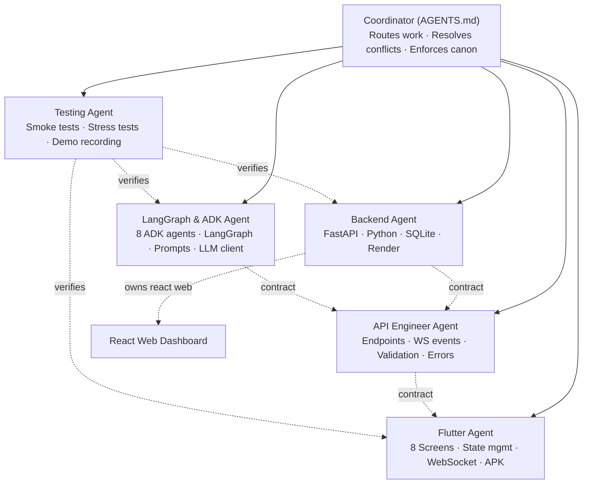

# AGENTS.md — SENTINEL Multi-Agent Development Team
> Global Coordination Document for All Sub-Agents
> Defines how every specialized agent in `.agents/` collaborates without contradiction

---

## 1. Mission

Six specialized AI development agents work together to build SENTINEL — the Signal-to-Action Autonomous Agent for the Google Antigravity Hackathon. Each agent owns one slice of the system and follows the same three reference documents (`idea.md`, `architecture.md`, `planning.md`) as the single source of truth. This file defines who does what, when, and how they hand off work.

---

## 2. The Six Agents

| Agent | File | Owns |
|-------|------|------|
| **Backend Agent** | `.agents/Backend_Agent.md` | FastAPI server, Python services, orchestration glue, database, deployment to Render |
| **LangGraph & ADK Agent** | `.agents/LangGraph_ADK_Agent.md` | All 8 ADK sub-agents, LangGraph executor, prompt engineering, LLM client, traces |
| **API Engineer Agent** | `.agents/API_Engineer_Agent.md` | REST endpoints, WebSocket events, request/response contracts, validation, errors |
| **Flutter Agent** | `.agents/Flutter_Agent.md` | Mobile app, all 8 screens, WebSocket consumer, state management, APK build |
| **Testing Agent** | `.agents/Testing_Agent.md` | Smoke tests, integration checks, manual test scripts, stress-test verification |
| **Coordinator** (implicit) | This file | Routes tasks, prevents contradictions, enforces the canon |

---

## 3. The Canon — Sources of Truth

Every agent MUST treat these three documents as canonical and never invent contradicting structures, names, or contracts:

1. **`idea.md`** — Modules, design philosophy, complete tech stack, full API contracts, database schema, evaluation criteria mapping
2. **`architecture.md`** — All mermaid diagrams and visual flows
3. **`planning.md`** — Hour-by-hour execution order and task dependencies

**Hierarchy when conflicts arise:** `idea.md` > `architecture.md` > `planning.md` > any agent file.

If an agent finds that the canon is wrong or incomplete, it must flag the issue rather than silently working around it. **No agent edits the canon without explicit user instruction.**

---

## 4. Universal Rules (All Agents Must Follow)

### 4.1 Naming Conventions
- Module numbers (1-15) from `idea.md` §5 are immutable references
- Pydantic model names: PascalCase (`Source`, `NoiseAssessment`, `Action`)
- Agent file names: snake_case ending in `_agent.py` (`planner_agent.py`)
- API paths: lowercase plural under `/api/v1/` (`/api/v1/runs`)
- WebSocket events: snake_case (`step_completed`, `approval_required`)
- Mock data files: lowercase snake_case (`warehouse_stock_7days.csv`)
- Run IDs: `run_<YYYY>_<MM>_<DD>_<6 hex chars>` (e.g., `run_2026_05_15_a4b8c1`)

### 4.2 Schema Discipline
- Every API request/response is a Pydantic model — no raw dicts
- Schemas defined in `backend/models/` are the single source of truth
- Flutter models and React types are derived from these — never the reverse
- Any field added to a backend model must propagate to client models in the same task

### 4.3 No Silent Drift
- If you need a new endpoint, event, or model field, surface it explicitly so other agents know
- If you change a constraint default, log it in the commit message
- Never rename a public symbol without coordinating with the API Engineer Agent

### 4.4 Free-Tier Discipline
- No paid services, no credit cards required
- All dependencies must work on Gemini free tier + Groq free tier + Render free tier + Vercel free tier
- Anything outside this list requires explicit user approval

### 4.5 Hackathon Velocity Rules
- No authentication or user accounts (not in scope)
- No Docker (not in scope)
- No unit testing framework (use smoke scripts)
- No CI/CD pipelines (manual deploys)
- No microservices (modular monolith only)
- These constraints are intentional — do not add complexity that isn't in `planning.md`

---

## 5. Agent Boundaries — Who Does What



### 5.1 Hard Boundaries
- **Backend Agent** never writes prompts (LangGraph & ADK Agent does)
- **LangGraph & ADK Agent** never writes HTTP route handlers (Backend Agent does)
- **API Engineer Agent** owns the contract between backend and clients — both other agents must comply
- **Flutter Agent** never modifies backend code, only consumes the API
- **Testing Agent** owns smoke scripts but never writes production code

### 5.2 Soft Boundaries (Coordination Needed)
- Database schema changes → Backend Agent leads, API Engineer reviews if it affects responses
- New WebSocket events → LangGraph Agent declares the event, API Engineer specifies the schema, Backend Agent implements emit, Flutter Agent implements consume
- New Pydantic model → Backend Agent defines, API Engineer validates contract, Flutter Agent mirrors in Dart
- Mock data changes → Testing Agent owns mock data files but LangGraph Agent uses them in prompts

---

## 6. Handoff Protocol — When Agents Pass Work

Every handoff follows this format. Agents write these into the commit message or chat context:

```
HANDOFF
FROM:    <source agent>
TO:      <target agent>
WHAT:    <one-sentence description>
CANON:   <module number / section reference>
INPUTS:  <files, schemas, or contracts the target needs>
OUTPUT:  <expected deliverable>
BLOCKING: <yes/no — does other work depend on this?>
```

**Example:**
```
HANDOFF
FROM:    Backend Agent
TO:      Flutter Agent
WHAT:    /api/v1/runs/<id> endpoint now returns RunReport with new metrics field
CANON:   idea.md §8.3 RunReport
INPUTS:  Updated RunReport schema in models/run_report.py
OUTPUT:  Flutter model RunReport.dart updated with metrics field; OutcomeScreen renders it
BLOCKING: yes
```

---

## 7. Conflict Resolution

When two agents disagree, resolve in this order:

1. **Check the canon** — does `idea.md`/`architecture.md`/`planning.md` already answer it?
2. **Check the boundary table in §5** — whose responsibility is this?
3. **Check the universal rules in §4** — does a rule apply?
4. **Defer to the API Engineer Agent** for any contract-related dispute
5. **Defer to the Backend Agent** for any data-shape dispute
6. **If still unresolved, surface to the user** — never silently pick a side

---

## 8. Daily Coordination Flow

### Day 1 — Agent Brain
**Lead agent:** LangGraph & ADK Agent
**Support agents:** Backend Agent (LLM client, metrics, Pydantic models), Testing Agent (mock data, smoke tests)

Flow:
1. Backend Agent scaffolds the project, creates `llm_client.py`, Pydantic models
2. Testing Agent creates 7 mock data files
3. LangGraph & ADK Agent writes Planner → Ingestion → Noise Filter → Insight → Conflict Resolver
4. Testing Agent runs end-of-day smoke test

### Day 2 — Execution + UI
**Lead agents:** LangGraph & ADK Agent (morning) → Flutter Agent (afternoon)
**Support agents:** Backend Agent (FastAPI routes), API Engineer Agent (contracts), Testing Agent

Flow:
1. LangGraph & ADK Agent writes Action Planner, Side-Effect Analyzer, LangGraph Executor
2. API Engineer Agent finalizes all endpoint and WebSocket schemas
3. Backend Agent implements FastAPI routes + WebSocket handler + orchestrator
4. Flutter Agent builds all 8 screens
5. Testing Agent runs end-to-end integration test

### Day 3 — Polish + Deploy
**Lead agent:** Backend Agent (deployment)
**Support agents:** Flutter Agent (APK), Testing Agent (stress tests, demo), API Engineer Agent (production contract verification)

Flow:
1. Backend Agent builds React web dashboard, deploys to Vercel + Render
2. Flutter Agent produces release APK
3. Testing Agent verifies all 5 stress-test scenarios + records demo video
4. All agents review final README

---

## 9. What Each Agent Must NOT Do

### Backend Agent must NOT
- Write agent prompts (delegate to LangGraph & ADK Agent)
- Define mobile UI structures
- Change API contracts without API Engineer review

### LangGraph & ADK Agent must NOT
- Write FastAPI route handlers
- Define database schemas
- Modify deployment configurations

### API Engineer Agent must NOT
- Write business logic inside route handlers
- Build agent reasoning logic
- Implement Flutter screens

### Flutter Agent must NOT
- Modify backend code or API contracts
- Add new endpoints (request them via handoff)
- Build the web dashboard (Backend Agent owns it)

### Testing Agent must NOT
- Modify production agent or route code
- Change canonical schemas
- Adjust constraint defaults (those are in idea.md)

---

## 10. Definition of Done — Each Agent's Bar

### Backend Agent's "Done"
- FastAPI server runs locally and on Render
- All endpoints from idea.md §8.1 implemented
- WebSocket streams correctly
- SQLite persistence works for runs
- README has working backend setup instructions

### LangGraph & ADK Agent's "Done"
- All 8 ADK agents from idea.md §5 implemented
- LangGraph executor handles success, retry, rollback, fallback
- Gemini → Groq fallback works
- ADK traces saved to `traces/<run_id>/`
- Smoke test passes end-to-end

### API Engineer Agent's "Done"
- Every endpoint matches idea.md §8.1 exactly
- Every WebSocket event matches idea.md §8.2 exactly
- Pydantic validation rejects malformed requests with clear errors
- API docs available at `/docs` show all endpoints
- Versioning (`/api/v1/`) consistently applied

### Flutter Agent's "Done"
- All 8 screens from idea.md §5 Module 15 implemented
- WebSocket connects, streams, reconnects gracefully
- Approval modal works correctly
- Threshold sliders update constraints
- APK builds in release mode and installs on physical device

### Testing Agent's "Done"
- Day 1 smoke test passes (pipeline runs end-to-end)
- Day 2 integration test passes (mobile app → backend → response)
- All 5 stress-test scenarios pass
- Demo video recorded showing all 6 wow moments

---

## 11. Universal Pre-Commit Checklist

Before any agent commits, it MUST verify:

- [ ] No API keys in code
- [ ] No `.env` files staged
- [ ] No paid-tier dependencies added
- [ ] No contradictions with the three canon documents
- [ ] No changes to canon files without explicit user approval
- [ ] No changes to other agents' owned files without handoff documentation
- [ ] Commit message follows conventional format: `<type>(<scope>): <message>`
  - Types: `feat`, `fix`, `chore`, `docs`, `refactor`, `test`
  - Scopes: `backend`, `agents`, `flutter`, `web`, `mock-data`, `docs`

---

## 12. Quick Reference — Where Things Live

| Concern | Owned By | File Location |
|---------|----------|---------------|
| Pydantic models | Backend Agent | `backend/models/` |
| Agent prompts | LangGraph & ADK Agent | `backend/prompts/` |
| ADK agents | LangGraph & ADK Agent | `backend/agents/` |
| FastAPI routes | Backend Agent | `backend/main.py` |
| WebSocket events | API Engineer Agent (contract) + Backend Agent (impl) | `backend/main.py`, idea.md §8.2 |
| LLM client | LangGraph & ADK Agent | `backend/utils/llm_client.py` |
| Mock APIs | Backend Agent | `backend/tools/mock_apis.py` |
| Mock data | Testing Agent | `mock-data/` |
| Flutter screens | Flutter Agent | `frontend-mobile/lib/screens/` |
| React dashboard | Backend Agent | `frontend-web/src/` |
| Smoke tests | Testing Agent | `backend/scripts/` |
| Demo video | Testing Agent | `demo/` |
| README | Backend Agent (with input from all) | `README.md` |

---

## 13. Closing Principle

**Every agent is replaceable. The canon is not.**

If an agent disappears tomorrow, another agent reading `idea.md` + `architecture.md` + `planning.md` + the agent's file in `.agents/` should be able to pick up exactly where the previous one left off. This means:

- No tribal knowledge
- No implicit decisions
- No "I'll remember to do this later"
- Everything important is written down in the canon or in commit messages

The goal is a 10/10 hackathon submission. Every agent serves that goal. Every conflict is resolved in service of that goal. Every shortcut is taken only if it doesn't sacrifice that goal.
