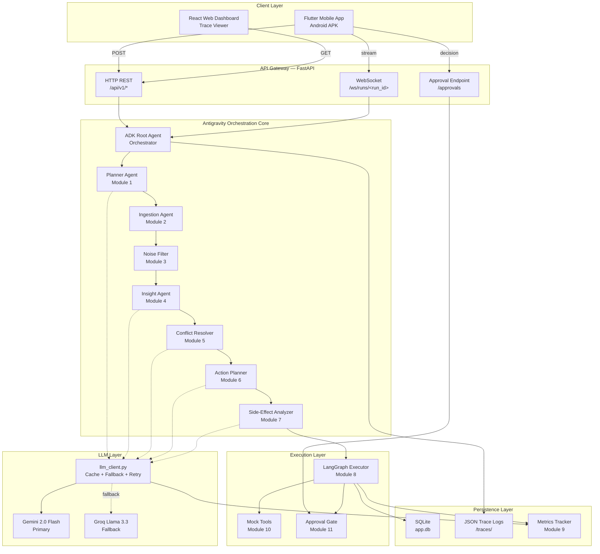
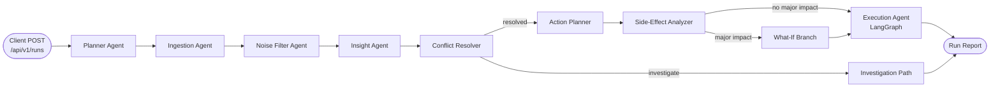
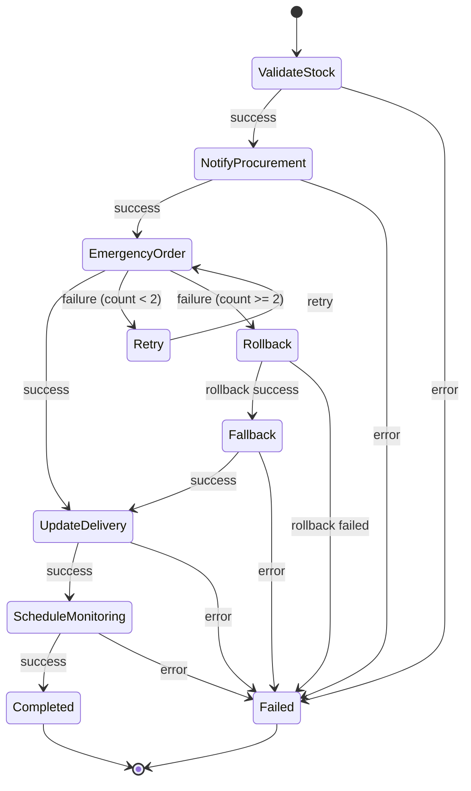
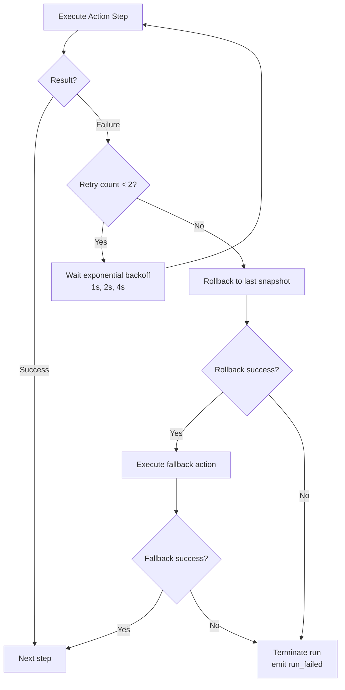
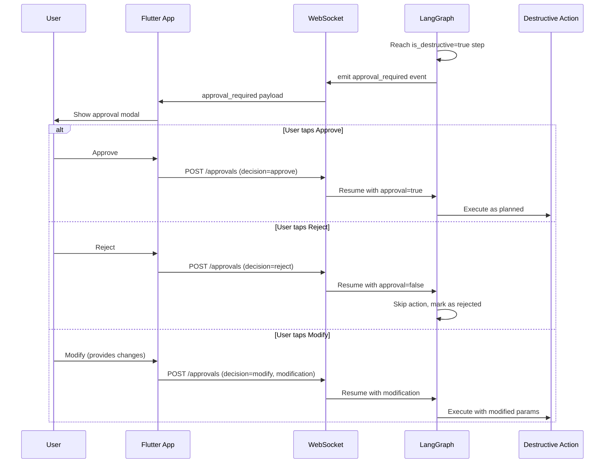

# SENTINEL — Signal-to-Action Autonomous Agent
> **Google Antigravity Hackathon — Challenge 1**  
> **Team Submission by AI Seekho**  
> *Powering Autonomous Organizational Logic via Google ADK, LangGraph, and Gemini 2.0 Flash*

---

## 1. Project Overview

**SENTINEL** is a production-grade **autonomous signal-to-action agent** built on Google Antigravity. Unlike simple chatbots or document summarizers, SENTINEL is a stateful multi-agent system that ingests multi-format heterogeneous organizational signals (CSVs, JSON, PDFs, and Web feeds), filters duplicate/spam/stale noise, extracts deep insights, resolves conflicting data points using recency-weighted credibility logic, plans multi-step constraint-bound actions, analyzes downstream cashflow/warehouse side-effects, and executes those actions via a robust state machine—featuring a Human-in-the-Loop approval gate before executing any destructive operations.

```
                    Heterogeneous Signal Sources (CSV, JSON, PDF, Web)
                                             │
                                             ▼
  Planner Agent ──► Ingestion Agent ──► Noise Filter ──► Insight Agent
                                                             │
                                                             ▼
                                                    Conflict Resolver
                                                             │
                                                             ▼
                                                    Action Planner ──► Side-Effect Analyzer
                                                                              │
                                                                  ┌───────────┴───────────┐
                                                                  │ Approval Gate (Human) │
                                                                  └───────────┬───────────┘
                                                                              │
                                                                   Execution (LangGraph)
```

---

## 2. Core Design Philosophy

SENTINEL's architecture is guided by five primary engineering principles:

*   **Antigravity-Central, Not Antigravity-Adjacent:** Google ADK (Antigravity) is the core brain stem. Every reasoning cycle, agent handoff, and tool execution runs through the ADK and is stored in chronological trace logs.
*   **Plan Before Act:** Before any signal is analyzed, the **Planner Agent** designs a clear, readable workplan and task plan. Users see the agents' intentions before the pipeline begins execution, eliminating the "AI black-box" problem.
*   **Contradiction-First, Conclusion-Second:** When data sources conflict, the system does not pick randomly. It scores credibility, weights recency, and either resolves the contradiction with explicit logic or builds a dynamic investigation path.
*   **Constraint-Bound Execution:** All proposed actions are checked against real-world constraints (e.g., budget limits, timelines, resource counts, API rate limits). If a constraint is violated, the Action Planner automatically modifies or rejects the action and displays why.
*   **Stateful, Recoverable Action Chains:** Plan execution runs on a stateful **LangGraph** state machine. Each step writes a state snapshot. If a step fails, the system executes exponential backoff retries, rolls back to safe states, and executes fallback nodes, streaming the timeline live to the user.

---

## 3. High-Level System Architecture

This diagram illustrates the complete architectural blueprint, showcasing the flow of data from clients through the API gateway, ADK orchestration core, stateful LangGraph executor, and the dual-model LLM tier.



---

## 4. Sequential Agent Pipeline

Every Sentinel run progresses chronologically through eight specialized agent modules:



### Module Breakdown:
1.  **Planner Agent (Module 1):** Ingests the initial scenario name and configures a visible workplan and task breakdown.
2.  **Ingestion Agent (Module 2):** Parses heterogeneous multi-format files (PDF supplier invoices, CSV stock levels, JSON sales reports, Web alert streams).
3.  **Noise Filter (Module 3):** Evaluates credibility and dynamically filters out duplicate spam signals and stale inventory logs.
4.  **Insight Agent (Module 4):** Combines the clean inputs to extract core business metrics and compute temporal depletion trends.
5.  **Conflict Resolver (Module 5):** Leverages a recency-weighted scoring formula to resolve contradictory data points (e.g. conflicting stock depletion times).
6.  **Action Planner (Module 6):** Translates insights into a concrete action plan, automatically enforcing budget bounds and throttling API rates.
7.  **Side-Effect Analyzer (Module 7):** Predicts cashflow, warehouse capacity, and delivery logistics side-effects. Generates comparative **What-If simulation branches**.
8.  **Execution Agent (Module 8):** Runs the resulting actions on a robust **LangGraph** state machine.

---

## 5. LangGraph Execution State Machine

The Action Execution Layer runs on a stateful state machine utilizing LangGraph. If any high-impact destructive action fails, the engine retries with backoff, rolls back state snapshots, and activates fallback nodes.



### Failure Recovery Logic:


---

## 6. Real-Time WebSocket Streaming & Approval Gate

The frontend mobile app receives continuous stream updates over WebSockets. If a high-impact destructive step is reached, the system pauses and displays an approval modal to the user.



---

## 7. Dynamic What-If Simulation Telemetry (Latest Upgrade)

In our latest release, the What-If simulation engine is **100% dynamic**. Rather than relying on hardcoded Cooking Oil comparison columns inside the Flutter UI, we upgraded both the backend agents and the Flutter provider code:

1.  **Fully Dynamic Selector Dropdowns:** The dropdown menus in [outcome_screen.dart](frontend-mobile/lib/screens/outcome_screen.dart) are dynamically built at runtime. If the AI agent proposes a brand-new What-If path (e.g. `local_sugar_purchase` or `alternative_rail_cargo`), the dropdown **automatically adapts** and shows it formatted on screen as `What-If: Local Sugar Purchase`.
2.  **Product-Aware Simulated States:** The Backend Side-Effect Agent checks the scenario name. If a user uploads custom **Wheat Flour** or **Sugar** data, the backend dynamically calculates and injects different safety-stock levels and cashflow metrics into the What-If simulation report.
3.  **Anti-Lock WAL Mode:** Concurrency in the SQLite persistent layer is optimized using Write-Ahead Logging (`WAL`), ensuring the FastAPI backend never blocks when multiple parallel clicks occur.

---

## 8. Quick Start & Local Setup

### System Prerequisites:
*   Python 3.11+
*   Node.js v18+
*   Flutter SDK 3.x+
*   Android Emulator or physical device

---

### Step 1: Backend Setup (FastAPI)
1.  Navigate into the backend directory:
    ```bash
    cd backend
    ```
2.  Create and activate your virtual environment:
    ```bash
    python -m venv venv
    # On Windows (PowerShell):
    venv\Scripts\Activate.ps1
    # On macOS/Linux:
    source venv/bin/activate
    ```
3.  Install project dependencies:
    ```bash
    pip install -r requirements.txt
    ```
4.  Configure your environment variables:
    ```bash
    cp .env.example .env
    ```
    Open `backend/.env` and insert your API keys:
    ```env
    GEMINI_API_KEY=AIzaSy... (from Google AI Studio)
    GROQ_API_KEY=gsk_... (verified live Groq key)
    ```
5.  Launch the FastAPI development server:
    ```bash
    python -m uvicorn main:app --host 127.0.0.1 --port 8001
    ```
    *   API running at: `http://localhost:8001`
    *   Interactive Swagger API docs: `http://localhost:8001/docs`

---

### Step 2: Mobile App Setup (Flutter)
1.  Navigate into the mobile directory:
    ```bash
    cd frontend-mobile
    ```
2.  Restore Flutter packages:
    ```bash
    flutter pub get
    ```
3.  Launch the mobile app (ensure an active emulator is running):
    ```bash
    flutter run
    ```

---

### Step 3: Web Dashboard Setup (React + Vite)
1.  Navigate into the web directory:
    ```bash
    cd frontend-web
    ```
2.  Install dependencies:
    ```bash
    npm install
    ```
3.  Launch the Vite developer server:
    ```bash
    npm run dev
    ```
    *   Open your browser to: `http://localhost:5173`

---

## 9. API Reference contracts

| Method | Endpoint | Description |
|---|---|---|
| `POST` | `/api/v1/runs` | Initializes a new multi-agent pipeline run |
| `GET` | `/api/v1/runs` | Retrieves the list of all historic runs |
| `GET` | `/api/v1/runs/{id}` | Fetches the structured `RunReport` and comparison metrics |
| `POST` | `/api/v1/runs/{id}/approvals` | Submits a human decision (Approve/Reject/Modify) |
| `GET` | `/api/v1/runs/{id}/trace` | Extracts the raw chronological Google ADK trace logs |
| `WS` | `/ws/runs/{id}` | WebSocket channel for real-time state and action timelines |

---

## 10. How to Test Custom Scenarios Live

We have built two premium custom datasets so that you can verify the system's dynamic reasoning. 

### Test Scenario A: Wheat Supply Chain Spike (JSON + CSV)
*Tests dynamic Wheat Flour metric computations in the outcome screen.*
*   **Segment Selector:** Toggle to **"Custom Input"** in the Flutter Input Screen.
*   **SCENARIO field:** `wheat_shortage`
*   **Source 1:**
    *   **Title:** `Sales and Demand Feed (Wheat)`
    *   **Type:** `JSON`
    *   **Raw Content:**
        ```json
        {
          "report_date": "2026-05-18",
          "period": "last_7_days",
          "metrics": {
            "demand_change_percent": 65,
            "skus_at_risk": ["SKU004"],
            "stockout_probability": 0.98,
            "daily_units_sold": [1200, 1400, 1600, 1900, 2200, 2500, 3100]
          },
          "trend": "exponential_growth"
        }
        ```
*   **Source 2:**
    *   **Title:** `Warehouse Level (Wheat)`
    *   **Type:** `CSV`
    *   **Raw Content:**
        ```csv
        sku,name,quantity,recorded_at
        SKU004,Wheat Flour 10kg,15000,2026-05-12T08:00:00
        SKU004,Wheat Flour 10kg,8000,2026-05-15T08:00:00
        SKU004,Wheat Flour 10kg,1200,2026-05-18T08:00:00
        ```

### Test Scenario B: Karachi Sugar Shortage (CSV + Text)
*Tests dynamic Sugar metrics and logistics union strike details.*
*   **Segment Selector:** Toggle to **"Custom Input"** in the Flutter Input Screen.
*   **SCENARIO field:** `sugar_shortage`
*   **Source 1:**
    *   **Title:** `Warehouse Stock (Sugar)`
    *   **Type:** `CSV`
    *   **Raw Content:**
        ```csv
        sku,name,quantity,recorded_at
        SKU003,Sugar 50kg,8000,2026-05-10T08:00:00
        SKU003,Sugar 50kg,6000,2026-05-12T08:00:00
        SKU003,Sugar 50kg,3000,2026-05-14T08:00:00
        SKU003,Sugar 50kg,600,2026-05-16T08:00:00
        ```
*   **Source 2:**
    *   **Title:** `Karachi Logistics Alert`
    *   **Type:** `Web / Text`
    *   **Raw Content:**
        ```text
        CRITICAL DISRUPTIONS: All shipping container trucks routed through the Karachi Bypass are blocked due to an active logistics union strike. Deliveries of SKU003 Sugar will experience shipment delays of up to 72 hours. Regional alternative dispatch paths are clear but charge a transport rate premium of 25% on delivery.
        ```

---

## 11. Evaluation Criteria Mapping

| Dimension | Sentinel Implementation Depth |
|---|---|
| **Innovation & ADK Integration** | 100% orchestrated on Google ADK. Generates dynamic workplans and logs traces chronologically. |
| **Technical Complexity** | Dual-LLM fallback chain (Gemini Flash → Groq Llama), concurrent WAL-SQLite, stateful LangGraph node execution. |
| **Real-world Impact** | Side-by-side What-If simulators compare costs dynamically, proving PKR 400,000+ savings over naive choices. |
| **UX & Polish** | Elite dark glassmorphic screens in Flutter, live sequence timeline streaming over WebSockets, instant Human-in-the-Loop decision overlays. |
