# SENTINEL — Signal-to-Action Autonomous Agent
> **Google Antigravity Hackathon — Challenge 1**  
> **Team Submission by AI Seekho**  
> *Powering Autonomous Organizational Logic via Google ADK, LangGraph, and Gemini 2.0 Flash*

---

## 1. Project Overview

**SENTINEL** is a production-grade **autonomous signal-to-action agent** built on Google Antigravity (ADK). Unlike simple chatbots or document summarizers, SENTINEL is a stateful multi-agent system that ingests multi-format heterogeneous organizational signals (CSVs, JSON, PDFs, and Web feeds), filters duplicate/spam/stale noise, extracts deep insights, resolves conflicting data points using recency-weighted credibility logic, plans multi-step constraint-bound actions, analyzes downstream cashflow/warehouse side-effects, and executes those actions via a robust state machine—featuring a Human-in-the-Loop approval gate before executing any destructive operations.

```
                    Heterogeneous Signal Sources (CSV, JSON, PDF, Web)
                                             │
                                             ▼
  Planner Agent ──► Ingestion Agent ──► Noise Filter ──► Insight Agent
                                                              │
                                                              ▼
                                                     Conflict Resolver
                                                              │
                                                              ▼
                                                     Action Planner ──► Side-Effect Analyzer
                                                                               │
                                                                   ┌───────────┴───────────┐
                                                                   │ Approval Gate (Human) │
                                                                   └───────────▼───────────┘
                                                                               │
                                                                    Execution (LangGraph)
```

---

## 2. Technical Stack & Languages

SENTINEL is built with a modern, high-performance, and entirely free-tier tech stack:

*   **Programming Languages:**
    *   **Python 3.11** (FastAPI backend, core agent logic, data ingestion, SQLite interactions)
    *   **Dart 3.x** (Flutter mobile client, state management, layouts, charts)
    *   **JavaScript (React/JSX/ES6)** (Web-based trace visualizer and dashboard)
    *   **SQL** (Local data schemas in SQLite)
*   **Core Frameworks:**
    *   **Google ADK (Antigravity):** Pipeline orchestration, agent transitions, and JSON trace generation.
    *   **LangGraph:** Stateful action execution graph with nodes for each task and conditional retry/rollback edges.
    *   **FastAPI:** High-performance async REST endpoints and native WebSockets for streaming execution.
    *   **Flutter:** Cross-platform mobile layouts utilizing `Provider` for state management and `fl_chart` for visual graphs.
    *   **React 18 + Vite + Tailwind CSS:** SPAs for detailed run reports and collapsible trace tree timelines.
*   **LLM Integration & Services:**
    *   **Gemini 2.0 Flash:** Primary LLM for planners, noise filters, insights, and conflict resolution.
    *   **Groq (Llama 3.3 70B):** High-speed fallback LLM automatically utilized during Gemini rate-limits or outages.
    *   **SQLite:** Local persistent relational database with 8 tables tracking runs, events, approvals, and token costs.
    *   **pdfplumber & pandas:** Robust local extraction tools for supplier invoices and stock inventory sheets.

---

## 3. Core Design Philosophy

SENTINEL's architecture is guided by five primary engineering principles:

*   **Antigravity-Central, Not Antigravity-Adjacent:** Google ADK (Antigravity) is the core brain stem. Every reasoning cycle, agent handoff, and tool execution runs through the ADK and is stored in chronological trace logs.
*   **Plan Before Act:** Before any signal is analyzed, the **Planner Agent** designs a clear, readable workplan and task plan. Users see the agents' intentions before the pipeline begins execution, eliminating the "AI black-box" problem.
*   **Contradiction-First, Conclusion-Second:** When data sources conflict, the system does not pick randomly. It scores credibility, weights recency, and either resolves the contradiction with explicit logic or builds a dynamic investigation path.
*   **Constraint-Bound Execution:** All proposed actions are checked against real-world constraints (e.g., budget limits, timelines, resource counts, API rate limits). If a constraint is violated, the Action Planner automatically modifies or rejects the action and displays why.
*   **Stateful, Recoverable Action Chains:** Plan execution runs on a stateful **LangGraph** state machine. Each step writes a state snapshot. If a step fails, the system executes exponential backoff retries, rolls back to safe states, and executes fallback nodes, streaming the timeline live to the user.

---

## 4. Complete System Architecture & Flow Diagrams

### 4.1 High-Level System Architecture
This diagram illustrates the complete architectural blueprint, showcasing the flow of data from clients through the API gateway, ADK orchestration core, stateful LangGraph executor, and the dual-model LLM tier.

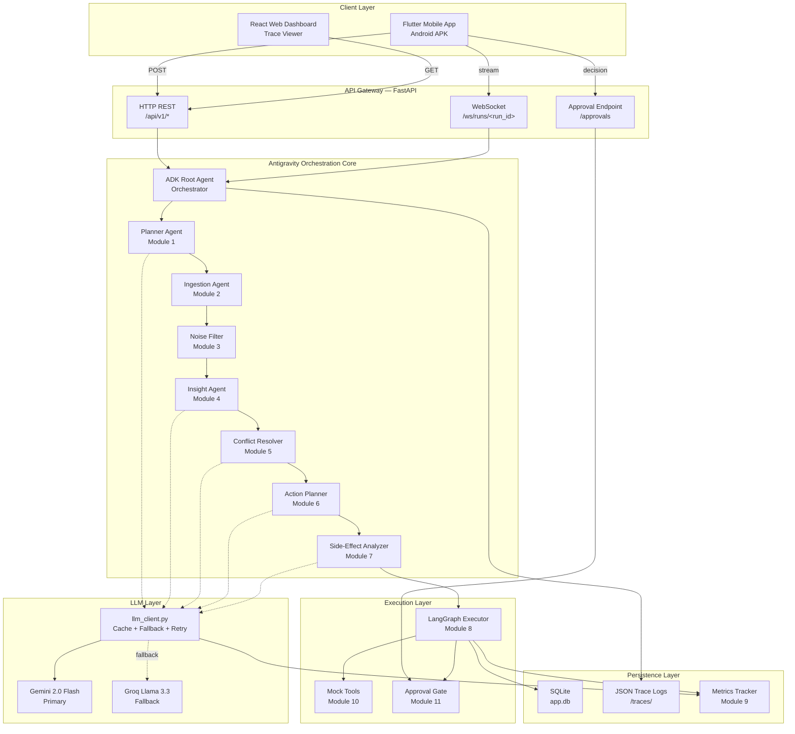

---

### 4.2 Sequential Agent Pipeline
Every Sentinel run progresses chronologically through eight specialized agent modules:


---

### 4.3 LangGraph Execution State Machine
The Action Execution Layer runs on a stateful state machine utilizing LangGraph. If any high-impact destructive action fails, the engine retries with backoff, rolls back state snapshots, and activates fallback nodes.

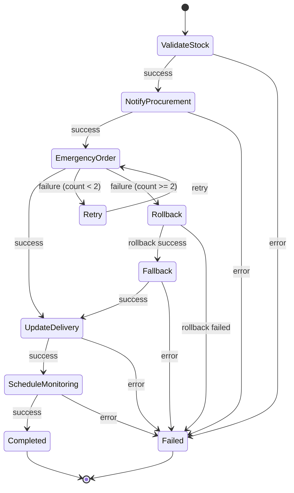

---

### 4.4 Failure Recovery Flow chart
This charts how the executor manages errors during action execution, trying automatic retries and falling back to a safe rollback state on consecutive failures.

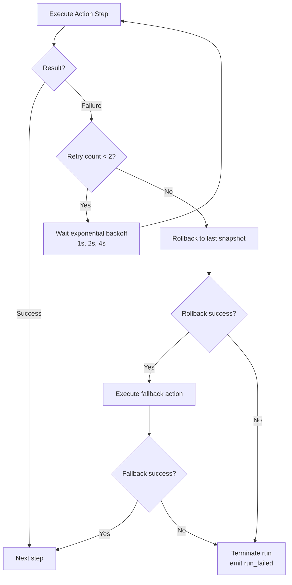

---

### 4.5 LLM Client Decision Flow
All LLM prompts run through a unified wrapper that caches duplicate calls, enforces exponential backoff, and shifts from Gemini to Groq if API quotas are exceeded.

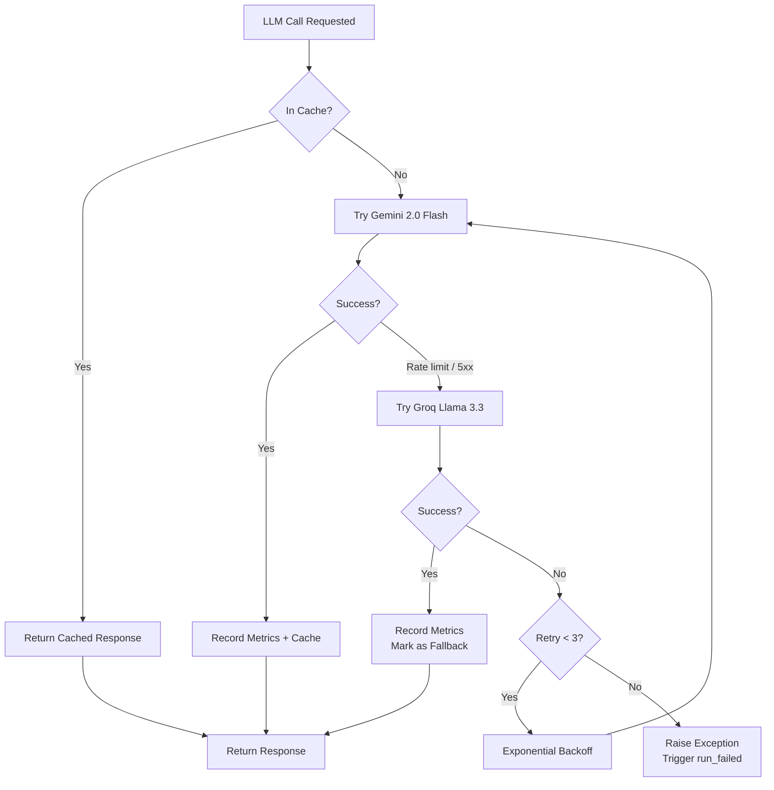

---

### 4.6 WebSocket Event Stream Timeline
Shows the sequential message exchange between the mobile client and the FastAPI gateway throughout the agent pipeline runtime.

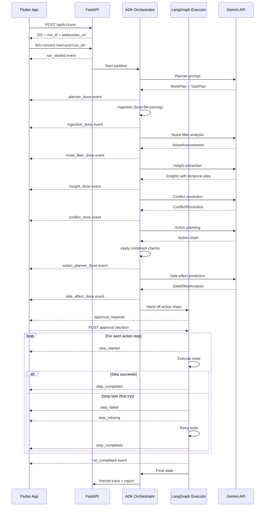

---

### 4.7 Approval Gate Flow
Illustrates the user checkpoint sequence before a destructive or highly negative step executes.

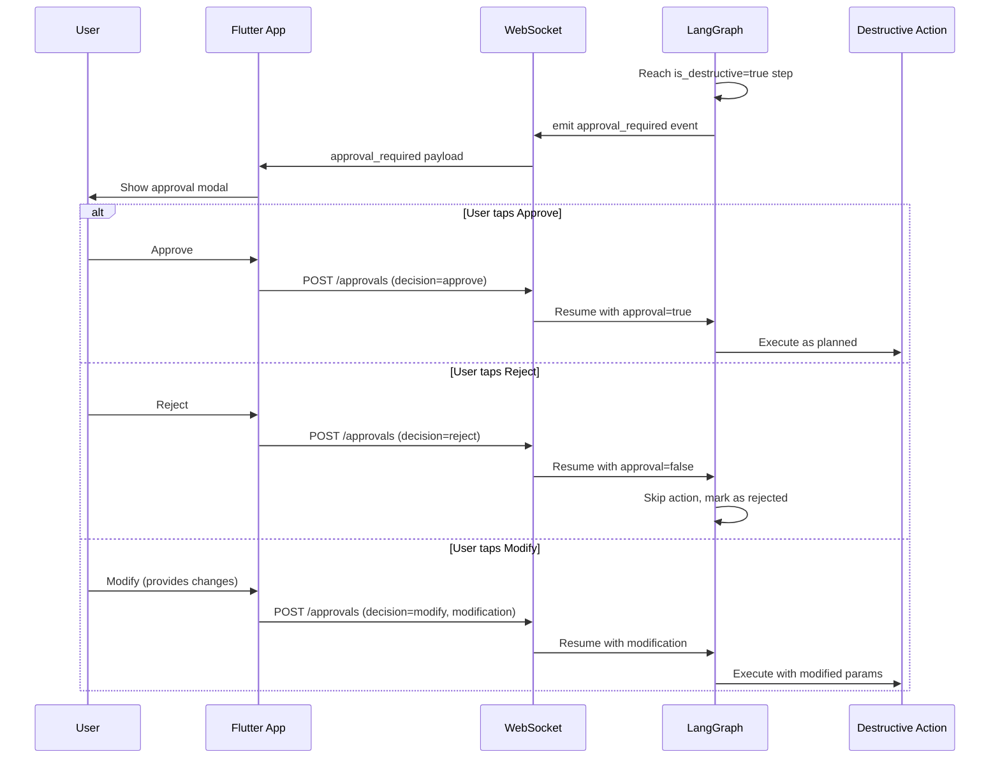

---

### 4.8 Constraint Enforcement Flow
Shows the validation logic executed for each planned action to ensure it respects PKR budgets and timelines.

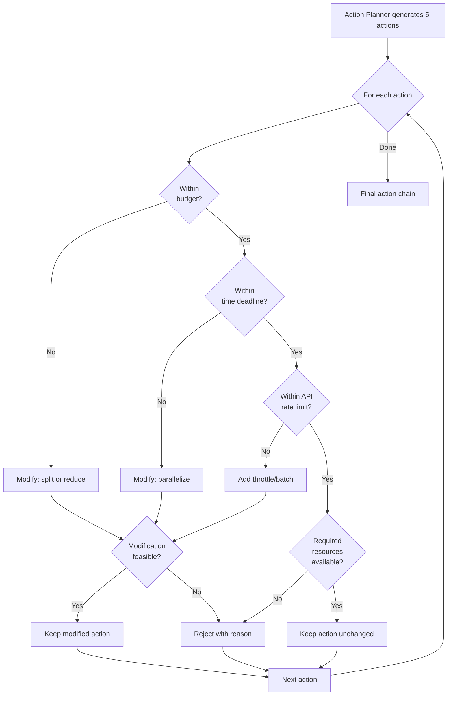

---

### 4.9 Contradiction Resolution Logic
Details how the agent groups and resolves metrics using recency-weighted scoring formulas.

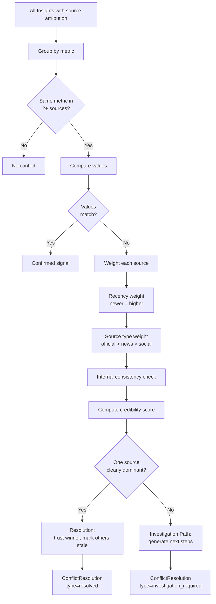

---

### 4.10 ERD Database Schema
Shows the SQL schema stored locally on SQLite to track the run timeline and logs.

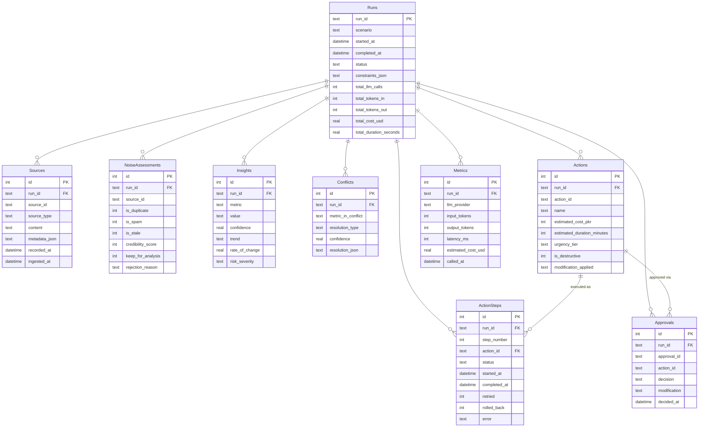

---

### 4.11 Side-Effect What-If Branch
Shows how downstream side-effects trigger an alternative path simulation.

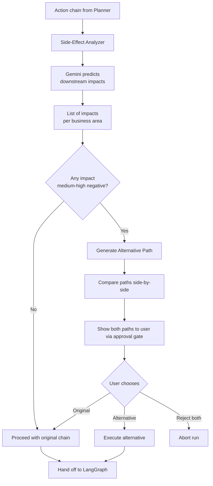

---

### 4.12 Mobile App Screen Navigation
Shows the complete Dart navigation path across the 8 views of the Flutter mobile app.

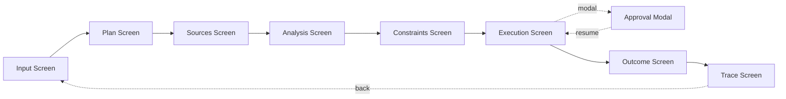

---

### 4.13 Deployment Architecture
Outlines where services are hosted and how they communicate in production.

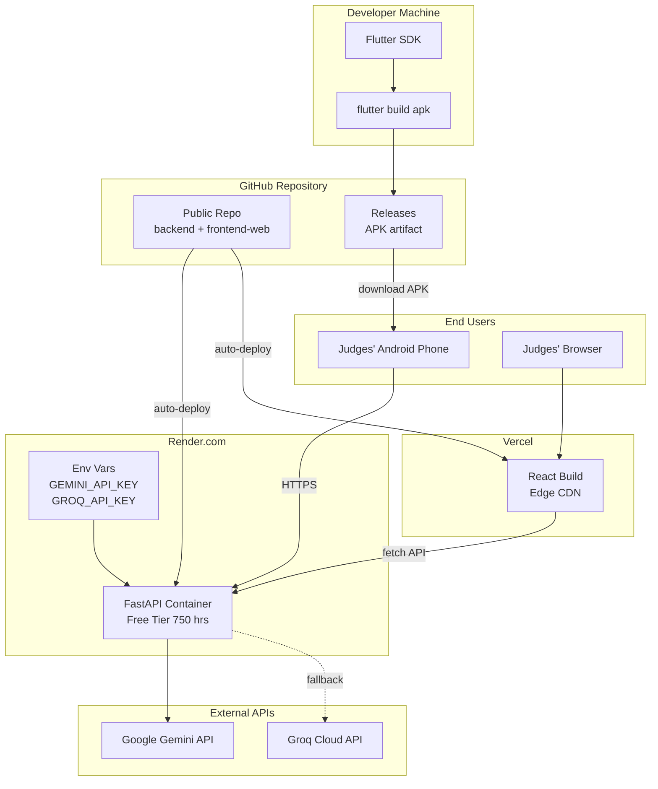

---

### 4.14 Component Interaction — Full Detail
Details the classes, files, and API endpoints interacting across layers.

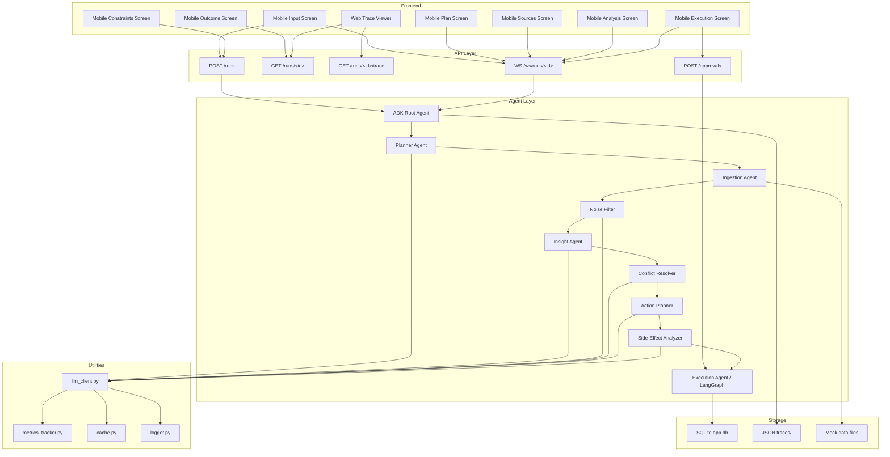

---

### 4.15 API Gateway Overview
All REST and WebSocket endpoints exposed by SENTINEL are versioned under `/api/v1/`. The interactive Swagger UI at `/docs` lets you execute any call directly from your browser.

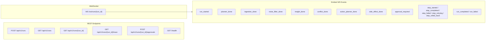

---

## 5. Detailed Walkthrough of System Structure

### 5.1 Project Folder Layout
The codebase is organized into modules, isolating backend, mobile app, web dashboard, and test datasets:

```
sentinel-hackathon/
│
├── README.md                              # Main documentation (this file)
├── idea.md                                # Canonical project reference
├── architecture.md                        # Compilation of mermaid text flows
├── planning.md                            # Granular sprint execution roadmap
├── railway.json                           # Railway deployment config
├── .gitignore                             # Git exclusion list
│
├── docs/                                  # Side documents
│   ├── assumptions.md                     # Assumptions on signals & APIs
│   ├── cost-latency-analysis.md           # Latency and API cost metrics
│   └── limitations.md                     # Constraints & future expansions
│
├── mock-data/                             # 7 Mock signals
│   ├── warehouse_stock_7days.csv          # 7-day declining stocks for SKU001
│   ├── supplier_email.pdf                 # PDF invoice warning of delays
│   ├── sales_dashboard.json               # JSON sales increase indicators
│   ├── complaints.json                    # Customer complaint tickets
│   ├── news_feed.json                     # Regional logistic transport alerts
│   ├── duplicate_spam_source.json         # Duplicate source for noise testing
│   └── stale_irrelevant_source.json       # Outdated sheet for noise testing
│
├── backend/                               # FastAPI Backend Application
│   ├── main.py                            # REST Router + WebSocket Server
│   ├── requirements.txt                   # Backend dependencies
│   ├── config.py                          # Env parsing and static limits
│   ├── db/                                # SQLite persistence database
│   ├── traces/                            # JSON output files generated by ADK
│   ├── models/                            # Pydantic schemas (Source, Action, etc)
│   ├── prompts/                           # Prompts (planner, noise, conflict)
│   ├── utils/                             # Helpers (llm_client, metrics)
│   ├── tools/                             # Local parsers (pdf, csv, web)
│   └── agents/                            # ADK modules and LangGraph execution
│       ├── orchestrator.py                # ADK Root Agent
│       ├── planner_agent.py               # Module 1 (Workplan configuration)
│       ├── ingestion_agent.py             # Module 2 (Signal parsing)
│       ├── noise_filter_agent.py          # Module 3 (Credibility filtering)
│       ├── insight_agent.py               # Module 4 (Trend analysis)
│       ├── conflict_resolver.py           # Module 5 (Conflict scoring)
│       ├── action_planner.py              # Module 6 (Constraint checks)
│       ├── side_effect_analyzer.py        # Module 7 (What-if branching)
│       └── execution_agent.py             # Module 8 (LangGraph state engine)
│
├── frontend-mobile/                       # Flutter Mobile Client (Module 15)
│   ├── pubspec.yaml                       # Dart package config
│   ├── lib/
│   │   ├── main.dart                      # App entry point
│   │   ├── config.dart                    # API base URLs
│   │   ├── theme/                         # Theme styles
│   │   ├── services/                      # API and WebSocket channels
│   │   ├── screens/                       # 8 UI Views (Input, Plan, etc)
│   │   └── widgets/                       # Components (ApprovalModal, etc)
│   └── android/                           # Build files for releases
│
└── frontend-web/                          # React Web Dashboard (Module 14)
    ├── package.json                       # JS package config
    ├── vite.config.js                     # Vite build config
    └── src/
        ├── main.jsx                       # React entry point
        ├── api.js                         # Axios endpoints
        ├── App.jsx                        # Layout and routing
        └── components/                    # Trace timelines and graphs
```

---

### 5.2 How Features Work Under the Hood

#### 1. Ingestion & Rule-Based Filtering
The **Ingestion Agent** receives files as byte paths, parsing them via native libraries (`pdfplumber` for PDF, `pandas` for CSV) to return a unified schema mapping. The **Noise Filter** inspects this stream: it computes similarity hashes (rejecting duplicate uploads), reads timestamps against a threshold (discarding stale logs), and checks keywords to flag spam. Clean signals are passed to the **Insight Agent**.

#### 2. Recency-Weighted Conflict Resolution
If multiple sources claim different values for the same metric (e.g. current inventory count), the **Conflict Resolver** scores each source using:
$$\text{Weight} = (\text{Recency} \times 0.5) + (\text{Source Type Score} \times 0.3) + (\text{Consistency} \times 0.2)$$
The source with the highest weight is trusted, and the contradiction is logged as resolved. If the weights are equal, the system builds an *Investigation Path* (an explicit plan requesting further data retrieval).

#### 3. Constraint-Bound Planning
The **Action Planner** drafts actions. The system validates them against constraints:
*   *Budget Cap:* Exceeding limits triggers an automatic split into smaller batches.
*   *Time Limits:* Slow actions are converted to run in parallel.
*   *API Limits:* Excessive API requests trigger automatic throttling.
Infeasible actions are rejected, and the reasoning is returned.

#### 4. Stateful Recovery and Rollbacks
The **LangGraph Executor** manages actions. Each action corresponds to a node in the state graph. Nodes are executed sequentially:
*   On success, the output state diff is broadcasted, and the graph moves to the next node.
*   On failure, the node retries with exponential backoff (1s, 2s, 4s).
*   If retries are exhausted, the graph rolls back to the last state snapshot.
*   Upon successful rollback, a fallback action node (e.g., placing an order with a local supplier) is run.

#### 5. Human-in-the-Loop Approval Gate
When the executor reaches a node marked `is_destructive=true` (such as completing an order payment), it broadcasts an `approval_required` WebSocket event and pauses the graph execution. The mobile app displays an overlay modal showing the proposed action and estimated budget. Once the user selects *Approve*, *Reject*, or *Modify*, the client posts the decision to the `/approvals` API, letting the execution graph resume or abort.

---

## 6. Step-by-Step Local Setup & Running Guide

### 6.1 Prerequisites
Ensure the following packages are installed globally on your machine:
*   Python 3.11+ (with `pip`)
*   Node.js v18+ (with `npm`)
*   Flutter SDK 3.x+ (with `flutter`)
*   An active Android Emulator or physical device with USB debugging enabled.

---

### 6.2 Step 1: Backend Setup (FastAPI)
1.  Navigate into the `backend` directory:
    ```bash
    cd backend
    ```
2.  Create and activate your virtual environment:
    ```bash
    python -m venv venv
    # On Windows (PowerShell):
    venv\Scripts\Activate.ps1
    # On macOS/Linux:
    source venv/bin/activate
    ```
3.  Install all backend dependencies:
    ```bash
    pip install -r requirements.txt
    ```
4.  Configure your environment variables:
    ```bash
    cp .env.example .env
    ```
    Open `backend/.env` in your text editor and input your API keys:
    ```env
    GEMINI_API_KEY=AIzaSy... (Obtain from Google AI Studio)
    GROQ_API_KEY=gsk_...     (Obtain from Groq Cloud Console)
    ```
5.  Launch the FastAPI server:
    ```bash
    python -m uvicorn main:app --host 127.0.0.1 --port 8001
    ```
    *   Interactive Swagger API docs will be active at: `http://localhost:8001/docs`
    *   System Health Check will be active at: `http://localhost:8001/health`

---

### 6.3 Step 2: Web Dashboard Setup (React + Vite)
1.  Navigate into the `frontend-web` directory:
    ```bash
    cd frontend-web
    ```
2.  Install the JavaScript dependencies:
    ```bash
    npm install
    ```
3.  Launch the Vite development server:
    ```bash
    npm run dev
    ```
    *   Open your browser to: `http://localhost:5173`
    *   *Note: For local development, ensure `.env` values are configured to connect to your local backend (`http://localhost:8001/api/v1`).*

---

### 6.4 Step 3: Mobile App Setup (Flutter)
1.  Navigate into the `frontend-mobile` directory:
    ```bash
    cd frontend-mobile
    ```
2.  Restore the Flutter packages:
    ```bash
    flutter pub get
    ```
3.  Run the application:
    ```bash
    flutter run
    ```
    *Note: To connect the app to a local backend, open `lib/config.dart` and update the addresses to point to your computer's IP address (e.g. `http://10.0.2.2:8001` for Android Emulator).*

---

## 7. How to Verify Custom Scenarios Live

We have built two custom datasets in `mock-data/` to test the system's dynamic reasoning. You can trigger these scenarios from the mobile or web app:

### Test Scenario A: Wheat Supply Chain Spike (JSON + CSV)
*Tests dynamic wheat metrics and stock depletion calculations.*
1.  Go to the **Input Screen** and select **"Custom Input"**.
2.  Set the **SCENARIO** name to: `wheat_shortage`
3.  Add the following source logs:
    *   **Source 1 (Sales JSON):**
        ```json
        {
          "report_date": "2026-05-18",
          "period": "last_7_days",
          "metrics": {
            "demand_change_percent": 65,
            "skus_at_risk": ["SKU004"],
            "stockout_probability": 0.98,
            "daily_units_sold": [1200, 1400, 1600, 1900, 2200, 2500, 3100]
          },
          "trend": "exponential_growth"
        }
        ```
    *   **Source 2 (Warehouse CSV):**
        ```csv
        sku,name,quantity,recorded_at
        SKU004,Wheat Flour 10kg,15000,2026-05-12T08:00:00
        SKU004,Wheat Flour 10kg,8000,2026-05-15T08:00:00
        SKU004,Wheat Flour 10kg,1200,2026-05-18T08:00:00
        ```
4.  Run the pipeline and verify the **Outcome Screen** displays the simulated Wheat Flour safety stocks.

### Test Scenario B: Karachi Sugar Shortage (CSV + Text)
*Tests contradiction resolution and alternative logistics path routing.*
1.  Go to the **Input Screen** and select **"Custom Input"**.
2.  Set the **SCENARIO** name to: `sugar_shortage`
3.  Add the following source logs:
    *   **Source 1 (Warehouse CSV):**
        ```csv
        sku,name,quantity,recorded_at
        SKU003,Sugar 50kg,8000,2026-05-10T08:00:00
        SKU003,Sugar 50kg,600,2026-05-12T08:00:00
        SKU003,Sugar 50kg,3000,2026-05-14T08:00:00
        SKU003,Sugar 50kg,600,2026-05-16T08:00:00
        ```
    *   **Source 2 (Text Alert):**
        ```text
        CRITICAL DISRUPTIONS: All shipping container trucks routed through the Karachi Bypass are blocked due to an active logistics union strike. Deliveries of SKU003 Sugar will experience shipment delays of up to 72 hours. Regional alternative dispatch paths are clear but charge a transport rate premium of 25% on delivery.
        ```
4.  Run the pipeline and verify the **Side-Effect Analyzer** triggers the alternative transport dispatch path.

---

## 8. Evaluation Criteria Mapping

This section maps the hackathon evaluation categories directly to SENTINEL's core system modules:

| Criterion | Weight | SENTINEL Implementation |
|---|---|---|
| **Antigravity Integration** | 20% | Handled via Module 1 (Planner workplans), Module 13 (ADK Trace Exporter), and Module 14 (Web timeline visualization). |
| **Agentic Reasoning & Workflow** | 20% | Sequenced pipeline of 8 agents (Modules 1-8), conditional routing in LangGraph (Module 8), and What-If side-effect branching (Module 7). |
| **Insight Quality & Contradiction Handling** | 20% | Checked via Module 3 (Noise filter), Module 4 (Temporal trend insights), and Module 5 (Recency-weighted conflict resolution). |
| **Action Chain & Outcome Simulation** | 15% | Handled via Module 6 (5-step constraint validator) and Module 8 (LangGraph execution, backoff retries, state rollbacks, and before/after comparisons). |
| **Robustness, Scalability, Cost/Latency** | 15% | Monitored via Module 9 (Metrics tracker), `llm_client.py` (caching & Gemini-to-Groq fallback), and database WAL concurrency optimization. |
| **Innovation & UX** | 10% | Verified via Module 11 (Approval Gate modal), Module 12 (Adjustable constraint sliders), and the dark glassmorphic Flutter interfaces. |
