# SENTINEL — System Architecture Diagrams
> Signal-to-Action Autonomous Agent
> Visual Architecture Reference for Engineering & Demo

---

## 1. High-Level System Architecture

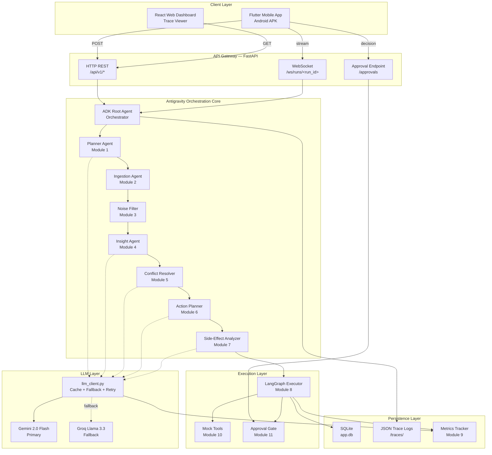

---

## 2. Sequential Agent Pipeline

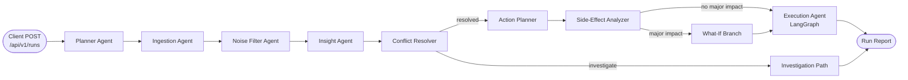

---

## 3. LangGraph Execution State Machine

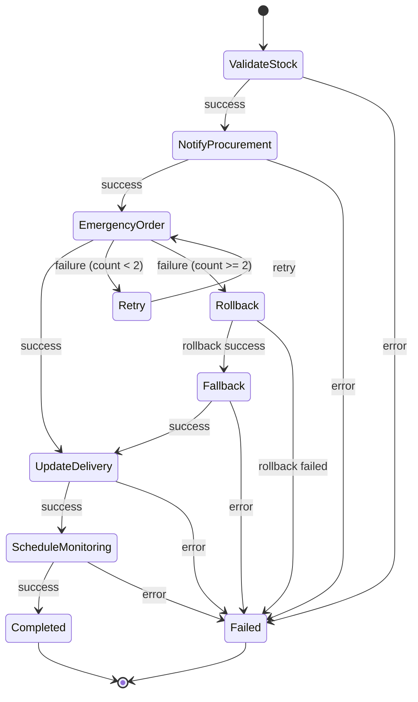

---

## 4. LLM Client Decision Flow

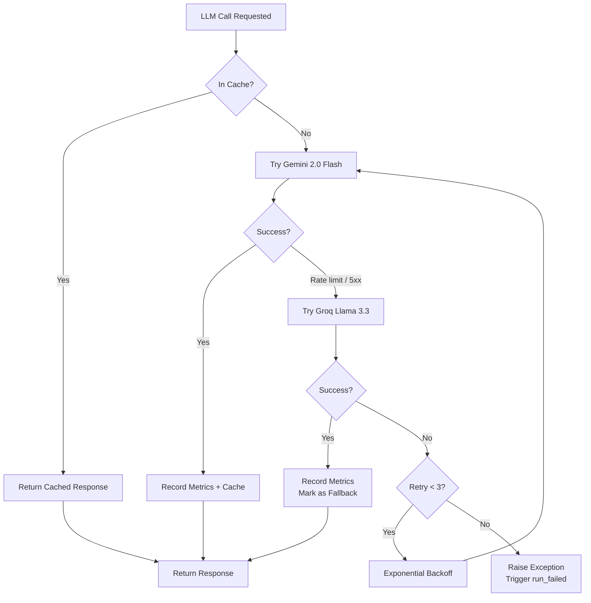

---

## 5. WebSocket Event Stream Timeline

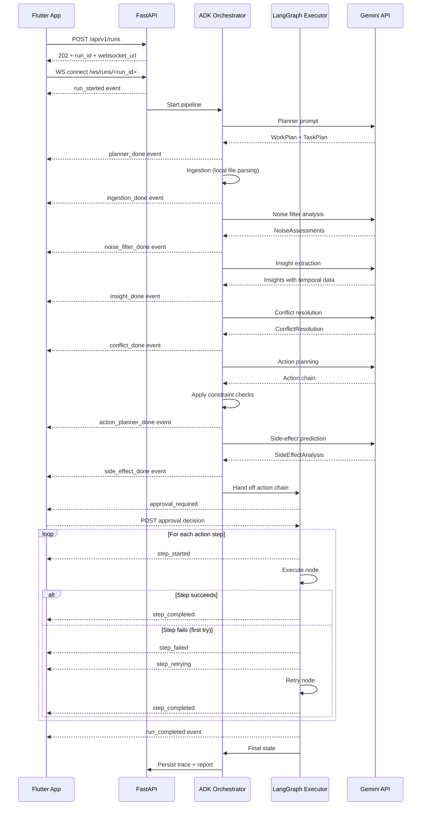

---

## 6. Approval Gate Flow

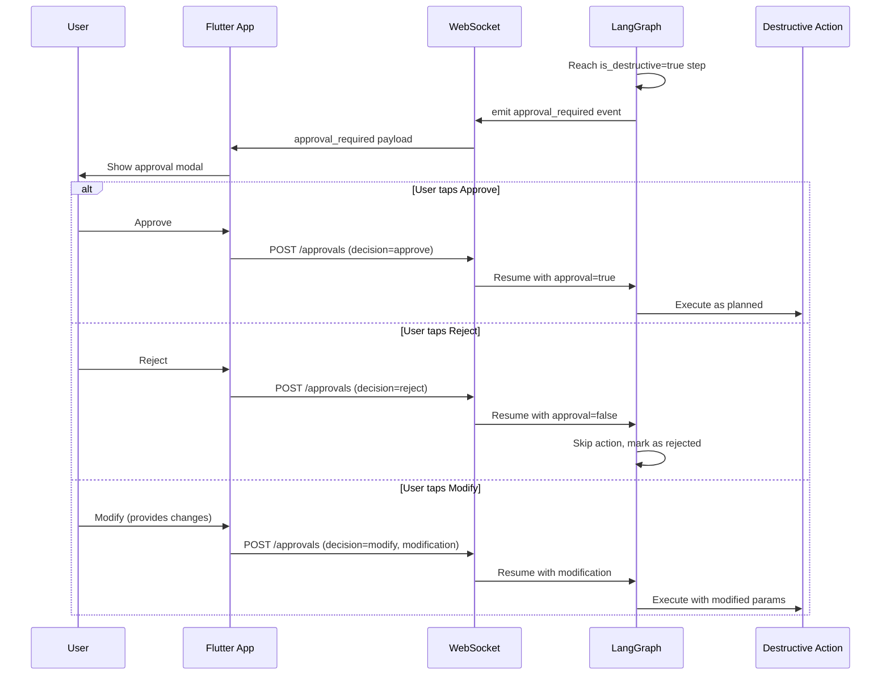

---

## 7. Constraint Enforcement Flow

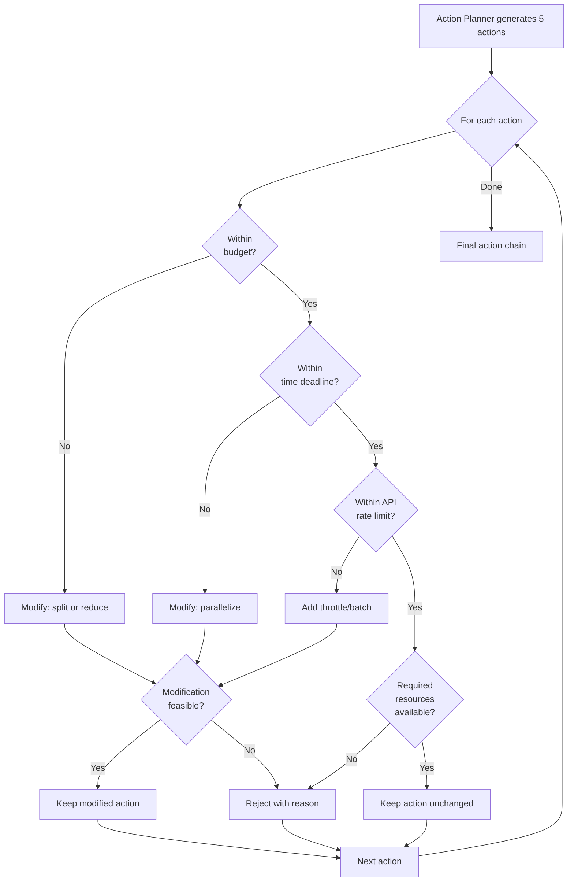

---

## 8. Contradiction Resolution Logic

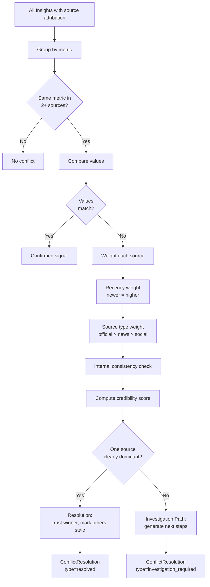

---

## 9. Database Schema

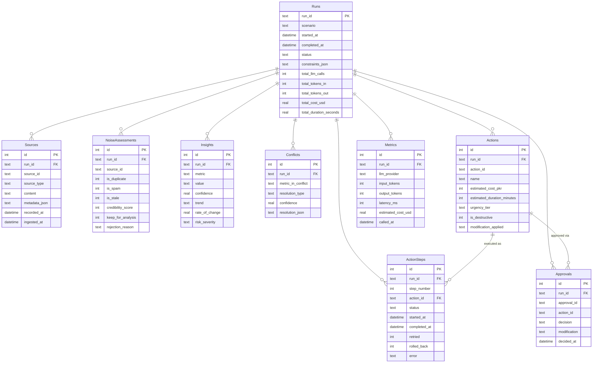

---

## 10. Failure Recovery Flow

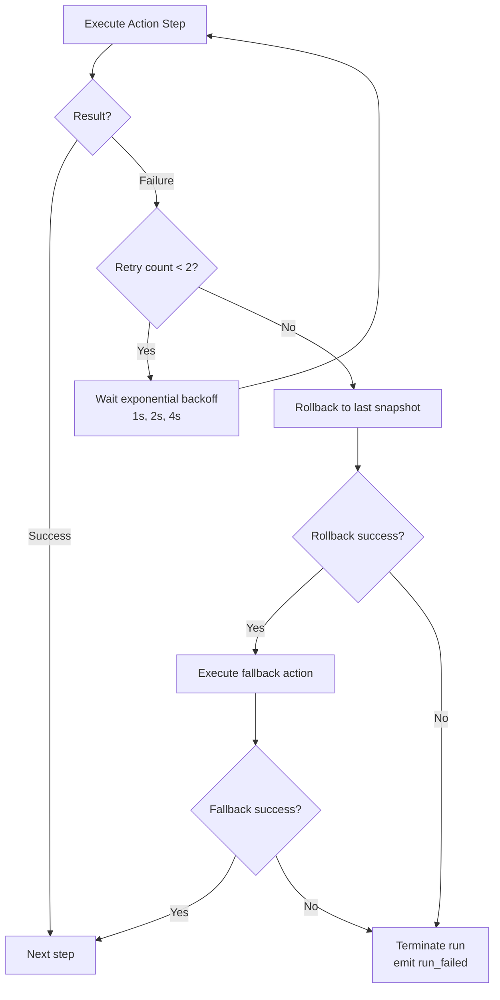

---

## 11. Side-Effect What-If Branch

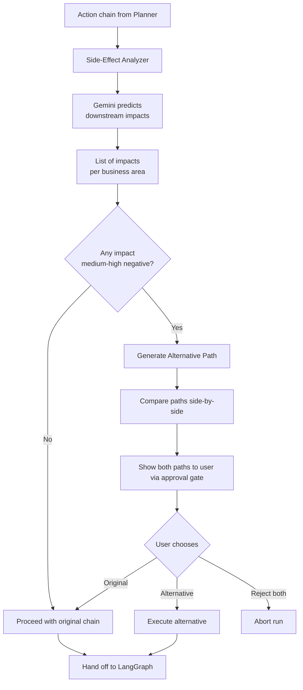

---

## 12. Mobile App Screen Navigation

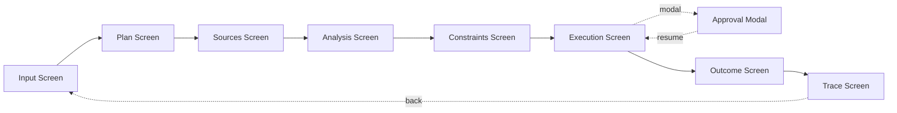

---

## 13. Deployment Architecture

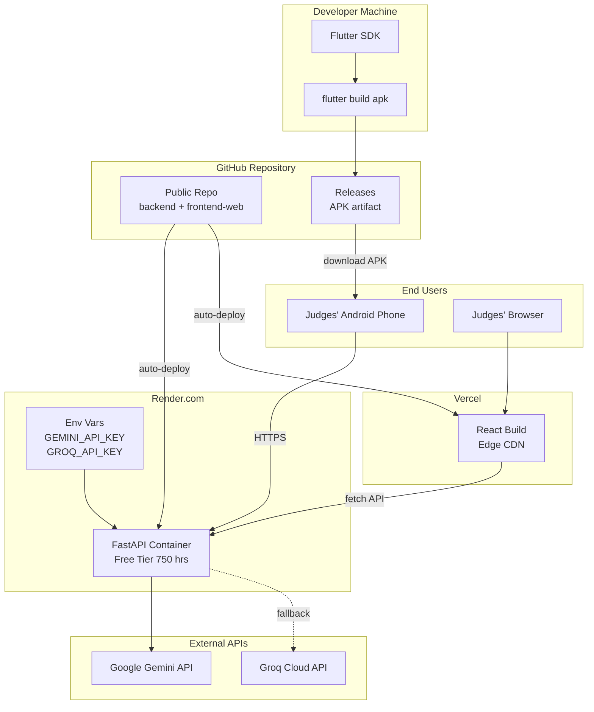

---

## 14. Component Interaction — Full Detail

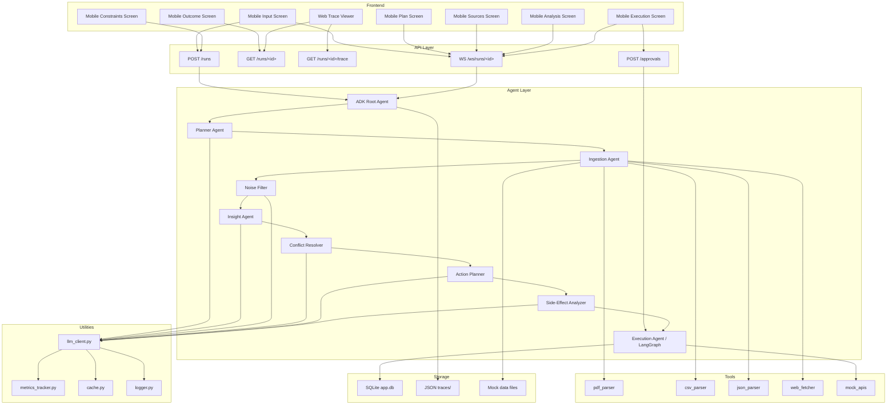

---

## 15. Demo Video Flow Map

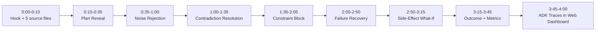
