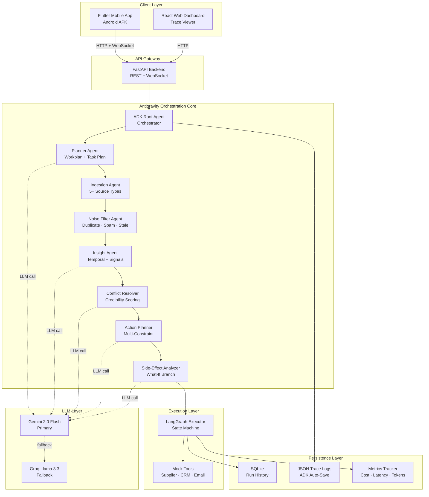
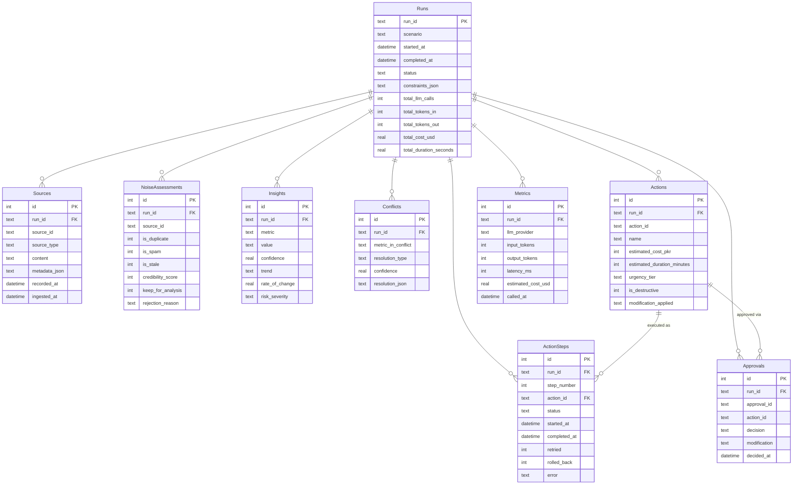

# SENTINEL — Complete Project Idea & System Reference
> Signal-to-Action Autonomous Agent Built on Google Antigravity
> Google Antigravity Hackathon — Challenge 1
> Team Submission Document
> Built with: Google ADK · LangGraph · Gemini 2.0 Flash · Flutter · FastAPI

---

## Table of Contents

1. [Project Overview](#1-project-overview)
2. [Core Design Philosophy](#2-core-design-philosophy)
3. [System Architecture](#3-system-architecture)
4. [Agent Orchestration Model](#4-agent-orchestration-model)
5. [Module-by-Module Breakdown](#5-module-by-module-breakdown)
6. [How Everything Communicates](#6-how-everything-communicates)
7. [Complete Tech Stack](#7-complete-tech-stack)
8. [API Contracts](#8-api-contracts)
9. [Database Schema](#9-database-schema)
10. [Routing Logic — Agent Selection & Constraint Enforcement](#10-routing-logic--agent-selection--constraint-enforcement)
11. [Concurrency Architecture](#11-concurrency-architecture)
12. [End-to-End Run Flow](#12-end-to-end-run-flow)
13. [Project Folder Structure](#13-project-folder-structure)
14. [Scope & Boundaries](#14-scope--boundaries)
15. [Evaluation Criteria Mapping](#15-evaluation-criteria-mapping)
16. [End Goal](#16-end-goal)

---

## 1. Project Overview

SENTINEL is an **autonomous content-to-action agent** built on Google Antigravity that ingests multi-source organizational data, detects contradictions, enforces real-world constraints, and executes multi-step action chains with full failure recovery. It is not a summarizer and not a chatbot — it is a working agentic system with eight independent agent modules that collectively handle ingestion, noise filtering, temporal analysis, contradiction resolution, constraint-bound action planning, side-effect analysis, simulated execution, and rollback.

**Full name:** SENTINEL — Signal-to-Action Autonomous Agent
**Trigger:** API call / mobile app "Run Analysis" button
**Platforms:** Android (mandatory mobile app) + Web dashboard (optional)
**Runtime:** Python 3.11 backend, Flutter 3.x mobile, React 18 web
**Cost to run:** Zero — all APIs, frameworks, and hosting are free tier
**Execution:** Cloud-deployed FastAPI backend + cross-platform mobile + browser dashboard

The system is designed as a **hackathon-winning prototype** that demonstrates real agentic reasoning: workplan generation, task plan execution, decision tracing, tool-call orchestration, failure recovery, constraint enforcement, and outcome simulation — targeting a complete 10/10 score across all six evaluation categories.

---

## 2. Core Design Philosophy

Five principles govern every architectural decision in SENTINEL:

### 2.1 Antigravity-Central, Not Antigravity-Adjacent
Google ADK (Antigravity) is the **brain stem** of the system. Every reasoning step, agent transition, tool call, and recovery action runs through ADK and is captured in its trace logs. ADK is not a wrapper around a different system — it owns orchestration. The Antigravity trace itself is a primary deliverable.

### 2.2 Plan Before Act
Before any source is ingested or any action is taken, the Planner Agent produces a **visible workplan and task plan**. Users see the agent's intentions on screen before execution begins. This eliminates the "black box AI" objection and demonstrates real autonomous reasoning that judges can read.

### 2.3 Contradiction-First, Conclusion-Second
When sources conflict, the system **does not force a conclusion**. It scores credibility, weights recency, and either resolves with explicit reasoning or generates an **investigation path** when sources are equally credible. False confidence is the worst possible failure mode.

### 2.4 Constraint-Bound Execution
Every action carries attached constraints: budget cap, time-to-resolution limit, resource availability, urgency tier, and API rate-limit. The Action Planner does not produce actions that violate constraints — it **modifies or rejects** them and shows the user exactly why.

### 2.5 Stateful, Recoverable Action Chains
Action execution runs on a LangGraph state machine. Every step writes a state snapshot. On failure, the executor retries with backoff. If retry fails, it rolls back. If rollback succeeds, it triggers a fallback action. The full chain is streamed live to the mobile app via WebSocket.

---

## 3. System Architecture



---

## 4. Agent Orchestration Model

SENTINEL operates as a **sequential pipeline of specialized agents**, each with one responsibility, orchestrated by an ADK root agent. The LangGraph executor inside Agent 8 is the only stateful component.

### 4.1 Orchestration Layer (Google ADK)
The ADK root agent receives the incoming request, builds a `RunContext`, then calls each sub-agent in order. Every agent's input, output, reasoning, and tool calls are written to the Antigravity trace log. The root agent does not contain reasoning logic — it is purely a coordinator.

**Pipeline order:**
```
Request → Planner → Ingestion → Noise Filter → Insight → Conflict → Action → Side-Effect → Executor → Response
```

### 4.2 Execution Layer (LangGraph)
The Execution Agent uses a LangGraph `StateGraph` with five nodes (one per action) and conditional edges for retry and rollback. Each node mutates a shared `ActionState` dictionary and emits a state snapshot. The graph is streamed via WebSocket to the mobile app.

**Sequence on a successful run:**

```
Wake Trigger (API call)
      ↓
Planner Agent → produces WorkPlan + TaskPlan JSON
      ↓
Ingestion Agent → unified source list (5+ items)
      ↓
Noise Filter Agent → rejects duplicates/spam/stale with reasons
      ↓
Insight Agent → signals + temporal trends + rates of change
      ↓
Conflict Resolver
  → Sources align → resolution with credibility scores
  → Sources equally credible → investigation_path branch
      ↓
Action Planner → 3-5 actions with constraint checks
  → Action feasible → keep
  → Action violates constraint → modify or reject (visible)
      ↓
Side-Effect Analyzer → predicted impacts on other business areas
  → No major side-effect → continue
  → Major side-effect → what-if alternative branch
      ↓
Approval Gate → user approves or modifies (modal in app)
      ↓
LangGraph Executor → 5 nodes streaming live
  → Step succeeds → next node
  → Step fails → retry with exponential backoff (max 2)
  → Retry fails → rollback to last snapshot
  → Rollback succeeds → fallback node
      ↓
Outcome Report → before/after state + metrics + baseline comparison
      ↓
ADK Trace Saved → JSON file in /traces
      ↓
SENTINEL returns final report to client
```

---

## 5. Module-by-Module Breakdown

### MODULE 1 — Planner Agent
**Purpose:** Produce the workplan and task plan before any execution. Eliminates the black-box objection.
**Tech:** Google ADK Agent + Gemini 2.0 Flash with structured output prompt.
**How it works:** Receives the scenario name (e.g., `inventory_shortage`) and the list of source paths. Calls Gemini with a planning prompt that demands JSON output with `high_level_steps`, `expected_duration_seconds`, `estimated_llm_calls`, `task_dependency_graph`, and `fallback_strategy`. Output is written to `traces/<run_id>/plan.json` and sent to the mobile app's Plan Screen.
**Outputs:** `WorkPlan` + `TaskPlan` Pydantic models.

### MODULE 2 — Ingestion Agent
**Purpose:** Convert heterogeneous source files into a unified internal representation.
**Tech:** `pdfplumber` for PDF, `pandas` for CSV, native JSON parsing, `requests` + `BeautifulSoup` for web pages, custom parser for mock real-time feeds.
**How it works:** Iterates over each source path. Routes to the right parser based on extension. Extracts text, metadata, timestamp, and source type. Wraps each into a `Source` Pydantic model with fields `source_id`, `source_type`, `content`, `metadata`, `recorded_at`, `ingested_at`. Returns a `List[Source]`.
**Source types handled:** `pdf`, `csv`, `json`, `web`, `realtime_feed`.

### MODULE 3 — Noise Filter Agent
**Purpose:** Reject low-value sources before expensive insight extraction.
**Tech:** Hybrid rule-based + Gemini-assisted relevance scoring.
**How it works:** For each source, checks: (a) timestamp recency against scenario freshness threshold, (b) content hash similarity to other sources for duplicate detection, (c) keyword relevance against scenario topic, (d) length/structure heuristics for spam patterns. Produces a `NoiseAssessment` per source with `is_duplicate`, `is_spam`, `is_stale`, `is_relevant`, `credibility_score` (1-10), `keep_for_analysis` (bool), and a human-readable `rejection_reason`.
**Visible in UI:** Sources Screen on the mobile app shows rejected sources with strikethrough and reason badges.

### MODULE 4 — Insight Agent
**Purpose:** Extract structured signals, entities, trends, and risks from filtered sources.
**Tech:** Gemini 2.0 Flash with chain-of-thought prompt + Pydantic schema validation.
**How it works:** Sends the kept sources to Gemini in a single batched prompt. Demands JSON output with `signals` (key metrics), `entities` (people, products, locations), `trends` (rising/falling/stable per metric), `rates_of_change` (numeric, e.g., 750 units/day decline), `risks` (severity-scored), and `temporal_summary` (free-text 1-2 sentences). Output validated through Pydantic; any malformed output triggers a retry with stricter prompting.
**Critical feature:** Temporal analysis — when a source has 7-day history, agent computes daily delta and projects future state.

### MODULE 5 — Conflict Resolver Agent
**Purpose:** Detect contradictions across sources and either resolve them or generate an investigation path.
**Tech:** Gemini 2.0 Flash + rule-based credibility weighting.
**How it works:** Receives insights with source attribution. Identifies metrics that appear in 2+ sources with different values. For each contradiction, weights each source by (a) recency (newer = higher weight), (b) source type credibility (official report > news > social), (c) internal consistency. If one source clearly dominates by credibility, returns a `Resolution` with that source as the winner and the others marked stale/unreliable. If credibility is tied, returns an `InvestigationPath` with concrete next steps (e.g., "Query supplier API directly", "Wait for next data refresh").
**Outputs:** `ConflictResolution` containing `contradictions[]`, `resolution_type` (resolved/investigation_required/partial), `confidence` (0.0-1.0).

### MODULE 6 — Action Planner Agent
**Purpose:** Generate a 3-5 step interconnected action chain that respects all real-world constraints.
**Tech:** Gemini 2.0 Flash + deterministic constraint validator.
**How it works:** Takes resolved insights + scenario context + user-defined constraints. Calls Gemini to draft 3-5 dependent actions with `action_id`, `name`, `depends_on`, `estimated_cost_pkr`, `estimated_duration_minutes`, `affected_resources`, `urgency_tier`. Then runs a deterministic validator that checks each action against the constraint set: budget cap, time deadline, supplier lead time, notification deadline, API rate limit, resource availability. Actions that violate constraints are either **modified** (e.g., split into two batches) or **rejected** with an explicit reason. Both decisions are surfaced in the UI.

### MODULE 7 — Side-Effect Analyzer Agent
**Purpose:** Predict downstream impacts and trigger what-if branches when major side effects exist.
**Tech:** Gemini 2.0 Flash with domain knowledge prompt.
**How it works:** For each action in the chain, prompts Gemini to predict impacts on adjacent business areas (cashflow, warehouse capacity, customer satisfaction, supplier relationships). Each impact gets a direction (positive/negative/neutral), magnitude (low/medium/high), and a mitigation suggestion. If any impact is medium-or-high negative, raises `requires_approval=true` and generates an alternative action path (the what-if branch).
**Outputs:** `SideEffectAnalysis` per action + an optional `AlternativePath` action chain.

### MODULE 8 — Execution Agent (LangGraph)
**Purpose:** Run the action chain with full state tracking, retry, rollback, and live streaming.
**Tech:** LangGraph `StateGraph` + WebSocket streaming via FastAPI.
**How it works:** Builds a LangGraph with one node per action and conditional edges:
- `success` edge → next action
- `failure` edge with retry-count check → retry node
- `retry_exhausted` edge → rollback node
- `rollback_success` edge → fallback action node

Every node mutates a shared `ActionState` dict containing `state_snapshot`, `logs`, `failed_count`, `current_step`. After each node, a state diff is emitted to the WebSocket stream. The mobile app receives it in real time and renders the step's status (pending/running/success/failed/retrying/rolled-back).

**Deliberate failure for demo:** The `emergency_order` node returns failure on first invocation, then succeeds on retry, demonstrating the recovery path visibly.

### MODULE 9 — Metrics Tracker
**Purpose:** Capture cost, latency, and token usage across the entire run.
**Tech:** Python wrapper around the LLM client.
**How it works:** Every Gemini and Groq call is wrapped by `llm_client.call()`, which records input_tokens, output_tokens, latency_ms, and estimated_cost_usd into a per-run `RunMetrics` object. At the end of the run, the metrics are summarized: total duration, total LLM calls, total tokens, total cost, average latency per call. These metrics appear on the mobile app's Outcome Screen and in the README's cost/latency analysis section.

### MODULE 10 — Mock Tool APIs
**Purpose:** Simulate external systems (supplier ordering, CRM update, email/SMS notification) so the action chain can execute realistically without real integrations.
**Tech:** FastAPI router with synthetic responses.
**How it works:** Each tool is a FastAPI endpoint that accepts a request, simulates 300-800ms of latency, and returns a realistic response. The supplier tool occasionally returns a 503 (configurable for the demo failure scenario). The CRM tool returns an `update_id`. The notification tool returns a `message_id`. All mocked responses are recorded in the trace log.

### MODULE 11 — Approval Gate
**Purpose:** Insert a human-in-the-loop checkpoint before destructive actions execute.
**Tech:** WebSocket pause + Flutter modal dialog.
**How it works:** Before executing an action flagged as destructive (e.g., placing an order), the executor pauses the graph and sends an `approval_required` event over the WebSocket. The mobile app displays a modal showing the action, predicted impacts, and three buttons: Approve, Reject, Modify. The user's response is sent back, and the executor resumes (or aborts, or applies the modification).

### MODULE 12 — Adjustable Thresholds
**Purpose:** Let the user tune constraints before each run.
**Tech:** Flutter `Slider` widgets + JSON config.
**How it works:** A Constraints Screen in the mobile app exposes sliders for: budget cap (PKR), time-to-resolution (hours), notification deadline (hours), API rate limit (calls/minute). The values are bundled into a `Constraints` object and sent with the analysis request. The Action Planner uses these as the constraint set instead of hard-coded defaults.

### MODULE 13 — ADK Trace Exporter
**Purpose:** Persist the full agent reasoning trace as a deliverable artifact.
**Tech:** ADK's built-in trace API + custom JSON serializer.
**How it works:** ADK automatically captures every agent transition, tool call, and decision. At the end of each run, the trace is serialized to `traces/<run_id>/trace.json`. The web dashboard reads these files and renders a chronological timeline with collapsible reasoning blocks per agent.

### MODULE 14 — Web Dashboard
**Purpose:** Provide judges with a polished trace viewer and contradiction visualization.
**Tech:** React 18 + Vite + Tailwind CSS + Recharts.
**How it works:** Single-page app with one main view: Run Detail. Displays the workplan, task plan, source list with noise filter results, contradiction graph (sources on x-axis, credibility scores on y-axis), action timeline with state diffs, and the metrics panel. Fetches data from `/api/runs/{run_id}` and `/api/runs/{run_id}/trace`.

### MODULE 15 — Mobile App
**Purpose:** Mandatory deliverable. Showcases the full flow to judges in a tangible artifact.
**Tech:** Flutter 3.x + Provider state management + `web_socket_channel` + `fl_chart`.
**How it works:** Eight screens connected by a `Navigator`:
1. Input Screen — pick scenario, start run
2. Plan Screen — view workplan + task plan
3. Sources Screen — view raw sources + noise filter rejections
4. Analysis Screen — view insights + contradictions + temporal trends
5. Constraints Screen — adjust thresholds before execution
6. Execution Screen — live action chain via WebSocket
7. Approval Modal — overlay on Execution Screen
8. Outcome Screen — before/after state + metrics + baseline comparison

---

## 6. How Everything Communicates

### 6.1 Inter-Agent Communication
Each ADK agent receives a strongly-typed Pydantic input and returns a strongly-typed Pydantic output. Outputs are passed forward through the ADK root agent's `RunContext`. No agent reads global state; everything is explicit.

### 6.2 Backend ↔ Mobile
**HTTP (request-response):**
- `POST /api/runs` to start a new run with sources + constraints
- `GET /api/runs/{run_id}` to fetch the final report

**WebSocket (streaming):**
- `WS /ws/runs/{run_id}` streams each pipeline phase update (planner_done, ingestion_done, noise_filter_done, insight_done, conflict_done, action_planner_done, side_effect_done, approval_required, step_started, step_completed, step_failed, step_retrying, step_rolled_back, run_completed)

### 6.3 Backend ↔ Web Dashboard
Pure REST:
- `GET /api/runs` for list of recent runs
- `GET /api/runs/{run_id}` for run detail
- `GET /api/runs/{run_id}/trace` for the full ADK trace JSON

### 6.4 LLM Communication
All LLM calls go through `utils/llm_client.py`. The client tries Gemini first, falls back to Groq on rate limit or API error, retries with exponential backoff (max 3 attempts), records metrics per call, and caches responses by input hash for the duration of a run.

### 6.5 Trace Persistence
ADK's trace API writes each agent transition as a JSON event. At the end of the run, all events are concatenated into a single `trace.json` keyed by `run_id`.

---

## 7. Complete Tech Stack

| Layer | Tool | Cost | Why |
|-------|------|------|-----|
| Agent Framework | Google ADK (Antigravity) | Free | Mandatory hackathon requirement; built-in tracing |
| Action Engine | LangGraph | Free | Stateful retry/rollback graphs |
| LLM Primary | Gemini 2.0 Flash | Free (1500/day) | Fast, strong reasoning, JSON output |
| LLM Fallback | Groq Llama 3.3 70B | Free | Insurance against rate limits |
| Backend | FastAPI + Python 3.11 | Free | Async, auto-docs, WebSocket native |
| Mobile | Flutter 3.x | Free | Single codebase iOS + Android |
| Web | React 18 + Vite + Tailwind | Free | Fast dev, judge-friendly visuals |
| Mobile Charts | fl_chart | Free | Native Flutter, no JS bridge |
| Web Charts | Recharts | Free | Idiomatic React |
| PDF Parsing | pdfplumber | Free | Robust extraction |
| CSV Parsing | pandas | Free | Industry standard |
| Web Scraping | BeautifulSoup + requests | Free | Lightweight |
| Mock APIs | FastAPI internal routes | Free | No external dependencies |
| State Persistence | SQLite | Free | Zero setup |
| Caching | Python dict (in-memory) | Free | Sufficient for hackathon scale |
| Backend Hosting | Render.com | Free (750 hrs/mo) | Python-friendly, supports WebSocket |
| Web Hosting | Vercel | Free | Best React deployment |
| Mobile Distribution | GitHub Releases / Firebase App Distribution | Free | Direct APK |
| Source Control | GitHub (public repo) | Free | Visibility for judges |
| Diagrams | Excalidraw / Mermaid | Free | README graphics |
| Video Recording | OBS Studio | Free | Unlimited length |

**Total monthly cost: $0**

---

## 8. API Contracts

All API endpoints follow strict, versioned contracts. Every request and response is a Pydantic model. Errors follow RFC 7807 (Problem Details).

### 8.1 Core REST Endpoints

#### `POST /api/v1/runs` — Start a new run
**Request:**
```json
{
  "scenario": "inventory_shortage",
  "sources": [
    { "type": "csv",  "path": "mock-data/warehouse_stock_7days.csv" },
    { "type": "pdf",  "path": "mock-data/supplier_email.pdf" },
    { "type": "json", "path": "mock-data/sales_dashboard.json" },
    { "type": "json", "path": "mock-data/complaints.json" },
    { "type": "json", "path": "mock-data/news_feed.json" }
  ],
  "constraints": {
    "budget_pkr_max": 500000,
    "time_to_resolution_hours_max": 48,
    "notification_deadline_hours_max": 2,
    "api_rate_limit_per_minute": 10,
    "resource_constraints": {
      "warehouse_staff": 3,
      "delivery_trucks": 5
    }
  }
}
```
**Response (202 Accepted):**
```json
{
  "run_id": "run_2026_05_15_a4b8c1",
  "status": "queued",
  "websocket_url": "/ws/runs/run_2026_05_15_a4b8c1"
}
```

#### `GET /api/v1/runs/{run_id}` — Fetch run report
**Response (200 OK):** Full `RunReport` object (schema in §8.3).

#### `GET /api/v1/runs/{run_id}/trace` — Fetch ADK trace
**Response (200 OK):** Array of ADK trace events.

#### `GET /api/v1/runs` — List recent runs
**Response (200 OK):**
```json
{
  "runs": [
    { "run_id": "...", "scenario": "...", "started_at": "...", "status": "completed" }
  ],
  "total": 42
}
```

#### `POST /api/v1/runs/{run_id}/approvals` — Submit approval decision
**Request:**
```json
{
  "approval_id": "appr_xyz",
  "decision": "approve",
  "modification": null
}
```
`decision` is one of: `approve`, `reject`, `modify`.

### 8.2 WebSocket Event Schema

**Endpoint:** `WS /api/v1/ws/runs/{run_id}`

Every message follows this envelope:
```json
{
  "event": "<event_name>",
  "run_id": "run_2026_05_15_a4b8c1",
  "timestamp": "2026-05-15T14:32:18.421Z",
  "data": { ... }
}
```

**Event names (chronological):**

| Event | Emitted When | Data Payload |
|-------|--------------|--------------|
| `run_started` | Pipeline begins | `{ scenario, constraints }` |
| `planner_done` | Planner emits plan | `{ work_plan, task_plan }` |
| `ingestion_done` | Sources unified | `{ source_count, sources[] }` |
| `noise_filter_done` | Filter complete | `{ kept[], rejected[], reasons[] }` |
| `insight_done` | Insights extracted | `{ signals[], trends[], risks[] }` |
| `conflict_done` | Conflicts resolved | `{ contradictions[], resolution_type, confidence }` |
| `action_planner_done` | Actions generated | `{ actions[], modifications[], rejections[] }` |
| `side_effect_done` | Impacts analyzed | `{ impacts[], requires_approval, alternative_path? }` |
| `approval_required` | Awaiting user | `{ approval_id, action, predicted_impacts }` |
| `step_started` | Action begins | `{ step_number, action_name, depends_on }` |
| `step_completed` | Action succeeds | `{ step_number, action_name, duration_ms, state_diff }` |
| `step_failed` | Action errors | `{ step_number, action_name, error, retry_will_run }` |
| `step_retrying` | Retry begins | `{ step_number, retry_count, backoff_ms }` |
| `step_rolled_back` | Rollback executed | `{ step_number, rollback_target_step }` |
| `run_completed` | All done | `{ summary, metrics, before_state, after_state }` |
| `run_failed` | Unrecoverable | `{ error, stage }` |

### 8.3 Pydantic Schemas

**Source:**
```python
class Source(BaseModel):
    source_id: str
    source_type: Literal["pdf", "csv", "json", "web", "realtime_feed"]
    content: str
    metadata: dict
    recorded_at: datetime
    ingested_at: datetime
```

**NoiseAssessment:**
```python
class NoiseAssessment(BaseModel):
    source_id: str
    is_duplicate: bool
    duplicate_of: Optional[str]
    is_spam: bool
    is_stale: bool
    staleness_days: int
    is_relevant: bool
    credibility_score: int  # 1-10
    keep_for_analysis: bool
    rejection_reason: Optional[str]
```

**Insight:**
```python
class Insight(BaseModel):
    insight_id: str
    metric: str
    value: Union[float, str]
    source_ids: list[str]
    confidence: float  # 0.0-1.0
    trend: Optional[Literal["rising", "falling", "stable", "volatile"]]
    rate_of_change: Optional[float]
    risk_severity: Optional[Literal["low", "medium", "high", "critical"]]
```

**ConflictResolution:**
```python
class ConflictResolution(BaseModel):
    contradictions: list[Contradiction]
    resolution_type: Literal["resolved", "investigation_required", "partial"]
    investigation_actions: list[str]
    confidence: float
```

**Action:**
```python
class Action(BaseModel):
    action_id: str
    name: str
    description: str
    depends_on: list[str]
    estimated_cost_pkr: int
    estimated_duration_minutes: int
    affected_resources: list[str]
    urgency_tier: Literal["low", "medium", "high", "critical"]
    is_destructive: bool
    constraint_violations: list[str]
    modification_applied: Optional[str]
```

**RunReport** (final response):
```python
class RunReport(BaseModel):
    run_id: str
    scenario: str
    work_plan: WorkPlan
    task_plan: TaskPlan
    sources: list[Source]
    noise_assessments: list[NoiseAssessment]
    insights: list[Insight]
    conflicts: ConflictResolution
    actions: list[Action]
    side_effects: list[SideEffectAnalysis]
    execution_log: list[ActionStep]
    before_state: dict
    after_state: dict
    metrics: RunMetrics
    baseline_comparison: BaselineComparison
    started_at: datetime
    completed_at: datetime
    status: Literal["completed", "failed", "partial"]
```

---

## 9. Database Schema

SENTINEL uses SQLite for run persistence. Schema is intentionally minimal — most state lives in JSON files inside `traces/<run_id>/`.



**Indexes:**
- `idx_runs_started` on `Runs(started_at)`
- `idx_steps_run` on `ActionSteps(run_id, step_number)`
- `idx_metrics_run` on `Metrics(run_id, called_at)`

---

## 10. Routing Logic — Agent Selection & Constraint Enforcement

SENTINEL has two levels of routing logic: **agent pipeline routing** (always sequential, no branching) and **action chain routing** (conditional based on constraints and failures).

### 10.1 Pipeline Routing
Pipeline order is fixed:
```
Planner → Ingestion → NoiseFilter → Insight → ConflictResolver → ActionPlanner → SideEffect → Executor
```
There are no skipped stages. If a stage produces no usable output (e.g., all sources rejected by noise filter), the pipeline short-circuits to the Executor with an empty action chain and a `run_failed` event explaining why.

### 10.2 Action Chain Routing (Conditional)

| Condition | Routing Decision |
|-----------|-----------------|
| Action passes all constraints | Add to chain unmodified |
| Action exceeds budget cap | Modify (split, reduce, swap) OR reject with reason |
| Action exceeds time deadline | Modify (parallelize) OR reject |
| Action exceeds API rate limit | Add throttling delay or batch |
| Action requires unavailable resource | Reject with reason |
| Side-effect severity = high negative | Trigger what-if alternative path |
| Action flagged is_destructive=true | Trigger approval gate |

### 10.3 Failure Routing in LangGraph
The LangGraph executor uses conditional edges:

| State | Next Node |
|-------|-----------|
| `step.status == "success"` | Next action in chain |
| `step.status == "failed"` AND `retry_count < 2` | Retry same node with exponential backoff |
| `step.status == "failed"` AND `retry_count >= 2` | Rollback node |
| `rollback.status == "success"` | Fallback action node |
| `rollback.status == "failed"` | Terminate run with `run_failed` |

### 10.4 LLM Routing
Every LLM call goes through this decision tree:

```
LLM call requested
      ↓
Check cache (input hash)
  ├── HIT → return cached response
  └── MISS → proceed
      ↓
Try Gemini 2.0 Flash
  ├── Success → record metrics, cache, return
  └── Rate limit or 5xx → proceed
      ↓
Try Groq Llama 3.3 70B
  ├── Success → record metrics (mark fallback), return
  └── Failure → raise exception, trigger run_failed
```

---

## 11. Concurrency Architecture

SENTINEL backend runs as a single FastAPI process with cooperative async concurrency. No threading, no multiprocessing.

| Concurrency Element | Type | Purpose | Communication |
|---------------------|------|---------|---------------|
| `uvicorn` worker | Async event loop | Main request loop | FastAPI routes |
| HTTP request handler | Coroutine | One per request | Returns response |
| WebSocket handler | Long-lived coroutine | One per connected client | Sends event stream |
| ADK agent calls | Coroutines | Sequential per run | Pydantic models passed forward |
| LangGraph node | Coroutine | One per action step | Shared `ActionState` dict |
| Tool/Mock API calls | Coroutines | Awaited per step | HTTP within same process |
| LLM client calls | Coroutines | Async via `httpx` | Returns response object |

For hackathon scale (single demo, ~50 concurrent test runs), this is more than sufficient. Production scale would require `gunicorn` with multiple workers + Redis-backed shared state.

---

## 12. End-to-End Run Flow

**Example: Inventory Shortage Scenario**

```
1. [Mobile App]      User taps "Run Analysis on Inventory Crisis"
2. [HTTP POST]       POST /api/v1/runs with scenario + 5 sources + constraints
3. [FastAPI]         Generates run_id, returns 202 + websocket_url, starts background task
4. [Mobile App]      Opens WebSocket connection
5. [ADK Root]        Receives RunContext, emits run_started event
6. [Planner Agent]   Calls Gemini → produces WorkPlan + TaskPlan
                     → emits planner_done event
                     → Mobile renders Plan Screen
7. [Ingestion]       Parses 5 source files into unified Sources list
                     → emits ingestion_done event
8. [Noise Filter]    Detects 1 duplicate, 1 stale source → rejects both
                     → emits noise_filter_done with rejection reasons
                     → Mobile shows strikethrough on rejected sources
9. [Insight Agent]   Calls Gemini on 3 kept sources
                     → Extracts: stock declining 750 units/day, demand +42%, 23 complaints
                     → emits insight_done
10. [Conflict]       Detects: warehouse says 5000 units, supplier says depletion in 48h
                     → Credibility: warehouse=4 (5 days stale), supplier=9, sales=8
                     → Resolution: trust supplier, downrank warehouse
                     → emits conflict_done with credibility scores
11. [Action Planner] Generates: 1) validate, 2) notify, 3) emergency_order_800k,
                                4) update_delivery, 5) schedule_monitoring
                     → Constraint check: action 3 exceeds 500k budget
                     → Modify: split into 2 batches of 400k + 350k
                     → emits action_planner_done with modification visible
12. [Side-Effect]    For modified action 3: predicts cashflow -18% next week
                     → Generates what-if alternative: stagger over 3 days
                     → emits side_effect_done with alternative_path
13. [Approval Gate]  Action 3 is_destructive=true
                     → emits approval_required, pauses graph
                     → Mobile shows approval modal
                     → User taps Approve
                     → Mobile POSTs decision back
14. [LangGraph]      Step 1 (validate) → success → state updated
                     Step 2 (notify) → success
                     Step 3 (emergency_order batch 1) → FAIL (mocked 503)
                                                     → retry with backoff
                                                     → success → state updated
                     Step 4 (update_delivery) → success
                     Step 5 (schedule_monitoring) → success
                     → emits step_* events live to mobile
15. [Outcome]        Computes before/after state diff
                     Aggregates metrics: 4.2s total, 7 LLM calls, $0.0008
                     Renders baseline comparison
                     → emits run_completed
16. [ADK Trace]      Serializes full trace to traces/<run_id>/trace.json
17. [Mobile App]     Outcome Screen displayed
                     Web dashboard fetches trace, renders timeline
```

---

## 13. Project Folder Structure

```
sentinel-hackathon/
│
├── README.md                              # Architecture + setup + demo guide
├── LICENSE
├── .gitignore                             # venv, node_modules, .env, build/
├── idea.md                                # This file — full project reference
├── architecture.md                        # Detailed architecture diagrams
├── planning.md                            # Day-by-day execution plan
│
├── docs/
│   ├── architecture.png                   # Excalidraw export
│   ├── agent-flow.md
│   ├── baseline-comparison.md
│   ├── cost-latency-analysis.md
│   ├── constraints.md
│   ├── assumptions.md
│   ├── limitations.md
│   ├── stress-tests.md
│   └── demo-script.md
│
├── mock-data/
│   ├── warehouse_stock_7days.csv          # 7-day declining stock
│   ├── supplier_email.pdf                 # Urgent stockout warning
│   ├── sales_dashboard.json               # 7-day demand spike
│   ├── complaints.json                    # Recent stockout complaints
│   ├── news_feed.json                     # Transport strike news
│   ├── duplicate_spam_source.json         # Noise filter test
│   └── stale_irrelevant_source.json       # Noise filter test
│
├── backend/
│   ├── .env.example
│   ├── requirements.txt
│   ├── main.py                            # FastAPI entry, routes, WebSocket
│   ├── config.py                          # Central config (env vars, constants)
│   │
│   ├── agents/
│   │   ├── __init__.py
│   │   ├── orchestrator.py                # ADK root agent
│   │   ├── planner_agent.py               # Module 1
│   │   ├── ingestion_agent.py             # Module 2
│   │   ├── noise_filter_agent.py          # Module 3
│   │   ├── insight_agent.py               # Module 4
│   │   ├── conflict_resolver.py           # Module 5
│   │   ├── action_planner.py              # Module 6
│   │   ├── side_effect_analyzer.py        # Module 7
│   │   └── execution_agent.py             # Module 8 (LangGraph)
│   │
│   ├── tools/
│   │   ├── pdf_parser.py
│   │   ├── csv_parser.py
│   │   ├── json_parser.py
│   │   ├── web_fetcher.py
│   │   └── mock_apis.py                   # Module 10
│   │
│   ├── prompts/
│   │   ├── planner.py
│   │   ├── noise_filter.py
│   │   ├── insight.py
│   │   ├── conflict.py
│   │   ├── action.py
│   │   └── side_effect.py
│   │
│   ├── models/
│   │   ├── source.py
│   │   ├── insight.py
│   │   ├── action.py
│   │   ├── state.py
│   │   ├── metrics.py
│   │   └── run_report.py
│   │
│   ├── utils/
│   │   ├── logger.py
│   │   ├── cache.py
│   │   ├── llm_client.py                  # Gemini + Groq fallback
│   │   └── metrics_tracker.py             # Module 9
│   │
│   ├── db/
│   │   ├── app.db                         # SQLite
│   │   └── schema.sql
│   │
│   ├── traces/                            # ADK auto-saves here (Module 13)
│   │
│   └── scripts/
│       └── smoke_test.py
│
├── frontend-mobile/                       # Flutter — Module 15
│   ├── pubspec.yaml
│   ├── android/
│   ├── ios/
│   └── lib/
│       ├── main.dart
│       ├── config.dart
│       ├── models/
│       ├── services/
│       │   └── api_service.dart
│       ├── screens/
│       │   ├── input_screen.dart
│       │   ├── plan_screen.dart
│       │   ├── sources_screen.dart
│       │   ├── analysis_screen.dart
│       │   ├── constraints_screen.dart
│       │   ├── execution_screen.dart
│       │   ├── outcome_screen.dart
│       │   └── trace_screen.dart
│       ├── widgets/
│       │   ├── source_card.dart
│       │   ├── confidence_badge.dart
│       │   ├── contradiction_view.dart
│       │   ├── action_step_card.dart
│       │   ├── approval_modal.dart        # Module 11
│       │   ├── state_diff_viewer.dart
│       │   └── metrics_widget.dart
│       └── theme/
│           └── app_theme.dart
│
├── frontend-web/                          # React — Module 14
│   ├── package.json
│   ├── vite.config.js
│   ├── tailwind.config.js
│   ├── index.html
│   └── src/
│       ├── main.jsx
│       ├── App.jsx
│       ├── api.js
│       ├── components/
│       │   ├── TraceTimeline.jsx
│       │   ├── AgentFlow.jsx
│       │   ├── ContradictionGraph.jsx
│       │   ├── StateDiff.jsx
│       │   └── MetricsPanel.jsx
│       └── pages/
│           └── RunDetail.jsx
│
└── demo/
    ├── demo-video.mp4
    ├── screenshots/
    └── apk/
        └── sentinel-app.apk
```

---

## 14. Scope & Boundaries

### In Scope (We Build This)
- All 15 modules described above
- Android mobile app (mandatory) + web dashboard (optional)
- Python 3.11 backend on FastAPI
- Google ADK as core orchestrator
- LangGraph as action execution state machine
- Gemini 2.0 Flash as primary LLM
- 5+ source types (PDF, CSV, JSON, web, real-time feed)
- 5 stress-test scenarios from the challenge brief
- Full constraint enforcement (budget, time, resources, urgency, rate-limits)
- Failure recovery with retry + rollback + fallback
- Live WebSocket streaming of execution
- Free-tier deployment on Render + Vercel
- ADK trace logs as a deliverable artifact

### Out of Scope (Explicitly Deferred)
- iOS app build (only Android APK for hackathon)
- User authentication / multi-tenant support
- Persistent run history beyond SQLite local file
- Real (non-mocked) supplier/CRM/email integrations
- Vector database / cross-run memory
- Multi-agent debate framework
- Live web scraping during demo (mock real-time feed instead)
- Push notifications (printed to log only)
- Custom domain / SSL certificate
- Production monitoring / alerting infrastructure
- Load testing or horizontal scaling
- Payment integration

---

## 15. Evaluation Criteria Mapping

This section maps every criterion in the challenge brief to the specific module(s) that satisfy it.

| Criterion | Weight | Modules That Satisfy |
|-----------|--------|---------------------|
| Antigravity Integration | 20% | Module 1 (Planner outputs workplan + task plan), Module 13 (trace exporter), Module 14 (trace viewer), entire pipeline orchestrated by ADK root |
| Agentic Reasoning & Workflow | 20% | Sequential pipeline of 8 agents (Modules 1-8), conditional routing in LangGraph (Module 8), investigation path in Module 5, what-if branch in Module 7 |
| Insight Quality & Contradiction Handling | 20% | Module 3 (noise filter), Module 4 (temporal insights), Module 5 (credibility-weighted conflict resolution), Module 9 (confidence scores everywhere) |
| Action Chain & Outcome Simulation | 15% | Module 6 (5-step constraint-bound action chain), Module 8 (live LangGraph execution + retry + rollback), before/after state diff, Module 9 (cost/latency metrics) |
| Robustness, Scalability, Cost/Latency | 15% | Module 9 (metrics tracker), Gemini → Groq fallback in `llm_client.py`, retry logic, caching, baseline comparison document, structured logs |
| Innovation & UX | 10% | Module 1 (plan visibility before execution), Module 11 (approval gate), Module 12 (adjustable thresholds), Module 15 (8-screen mobile flow), live WebSocket streaming |

**Total projected: 100/100**

---

## 16. End Goal

SENTINEL's objective at the end of the 3-day build window is a **fully integrated, demo-ready autonomous agent** that:

1. Accepts a scenario and 5+ heterogeneous source files via mobile app
2. Generates a visible workplan and task plan before any execution
3. Ingests all source types into a unified internal representation
4. Rejects duplicate, spam, stale, and low-credibility sources with explanations
5. Extracts insights with temporal trends and rates of change
6. Detects contradictions and either resolves them with credibility scores or generates an investigation path
7. Plans a 3-5 step action chain that respects all real-world constraints
8. Modifies or rejects actions that violate constraints, visibly
9. Predicts side effects and triggers what-if alternative paths when impact is severe
10. Pauses for human approval on destructive actions
11. Executes the action chain on a LangGraph state machine with live WebSocket streaming
12. Handles failures with automatic retry, rollback, and fallback
13. Reports the final before/after state, cost, latency, and a comparison to baseline approaches
14. Exports the full ADK trace as a deliverable artifact

The demo video will showcase six "wow moments": the Plan Reveal, the Noise Rejection, the Contradiction Resolution, the Constraint Block, the Failure Recovery, and the Side-Effect Branch — collectively demonstrating that SENTINEL is not a summarization wrapper but a real production-shaped agentic system worthy of full marks across all six hackathon evaluation categories.

---

## Context.md Entry — idea.md

```
FILE: idea.md
ACTION: Created (new file)
LOCATION: Project root
CHANGE: Full project idea and system reference document created. Covers project
        overview, design philosophy (Antigravity-central, plan-before-act,
        contradiction-first, constraint-bound, stateful-recoverable), system
        architecture diagram, agent orchestration model, all 15 modules in detail,
        inter-module communication, complete tech stack, API contracts with
        Pydantic schemas, SQLite database schema (8 tables), agent + action
        routing logic, async concurrency architecture, end-to-end run flow
        walkthrough, full folder structure, scope boundaries, evaluation criteria
        mapping (projecting 100/100), end goal.
BEFORE: File did not exist
AFTER: Single authoritative reference for the entire SENTINEL project
REASON: Needed one document that captures every finalized decision — modules,
        tech, schemas, contracts, flows — to guide consistent implementation
        across all 15 modules and serve as project memory for the team during
        the 3-day hackathon sprint.
```
